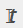

= Manage backups
:icons: font
:imagesdir: ../media/

[.lead]
You can rename and delete backups. You can also delete multiple backups simultaneously.

== Rename backups

You can rename backups if you want to provide a better name to improve searchability.

*Steps*

. In the left navigation pane, click *Resources*, and then select the appropriate plug-in from the list.
. In the Resources page either select the resource or resource group from the *View* drop-down list.
. Select the resource or resource group from the list.
+
The resource or resource group topology page is displayed. If the resource or resource group is not configured for data protection, the Protect wizard is displayed instead of the topology page.

. From the Manage Copies view, select *Backups* from the primary storage systems.
+
You cannot rename the backups that are on the secondary storage system.
+
If you have cataloged the backups of Oracle databases using Oracle Recovery Manager (RMAN), you cannot rename those cataloged backups.

. Select the backup, and then click .
. In the *Rename backup as* field, enter a new name and click *OK*.

== Delete backups

You can delete backups if you no longer require the backup for other data protection operations.

.Before you begin

You must have deleted the associated clones before deleting a backup.

NOTE: If a backup is associated with a cloned resource, you cannot delete the backup.

*Steps*

. In the left navigation pane, click *Resources*, and then select the appropriate plug-in from the list.
. In the Resources page either select the resource or resource group from the *View* drop-down list.
. Select the resource or resource group from the list.
+
The resource or resource group topology page is displayed.

. From the Manage Copies view, select *Backups* from the primary storage systems.
+
You cannot delete the backups that are on the secondary storage system.

. Select the backup, and then click image:../media/delete_icon.gif[delete icon].
+
If you are deleting a SAP HANA database backup, the associated SAP HANA catalogs of the backup are also deleted.
+
NOTE: If the last remaining backup is deleted, the associated HANA catalog entries cannot be deleted.

. Click *OK*.
+
NOTE: If you have some stale database backups in SnapCenter which do not have corresponding backups on the storage system, you must use remove-smbackup command to clean up these stale backup entries. If the stale backups were cataloged, they will be uncataloged from the recovery catalog database.

== Remove protection

Remove protection deletes all the backups and detaches all the policies. Before removing protection, you should ensure that the backups are not mounted and no clones are associated with the backup.

*Steps*

. In the left navigation pane, click *Resources*, and then select the appropriate plug-in from the list.
. In the Resources page either select the resource or resource group from the *View* drop-down list.
. Select the resource or resource group from the list.
+
The resource or resource group topology page is displayed.

. Select the backup and click *Remove Protection*.
