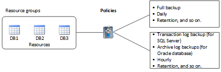
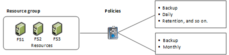

= Resources, resource groups, and policies
:icons: font
:imagesdir: ../media/

[.lead]
Before you use SnapCenter, it is helpful to understand basic concepts related to the backup, clone, and restore operations you want to perform. You interact with resources, resource groups, and policies for different operations.

* Resources are typically databases, Windows file systems, or file shares that you back up or clone with SnapCenter.
+
However, depending on your environment, resources might be database instances, Microsoft SQL Server availability groups, Oracle databases, Oracle RAC databases, Windows file systems, or a group of custom applications.

* A SnapCenter resource group, is typically a collection of resources on a host or cluster. However, a resource group can contain a single resource.
+
When you perform an operation on a resource group, you perform that operation on all the resources defined in the resource group according to the schedule you specify for the resource group.
+
You can back up on demand a single resource or a resource group. You also can configure scheduled backups for single resources and resource groups.
+
NOTE: If you put one host of a shared resource group on maintenance mode, and if there are schedules associated with the same shared resource group, all the scheduled operations will be suspended for all of the other hosts of the shared resource group.
+
You should use a database plug-in to back up databases, a file system plug-in to back up file systems, and the SnapCenter Plug-in for VMware vSphere to backup VMs and datastores.

* Policies specify the backup frequency, copy retention, replication, scripts, and other characteristics of data protection operations.
+
When you create a resource group, you select one or more policies for that group. You can also select a policy when you perform a backup on demand.

Think of a resource group as defining _what_ you want to protect and when you want to protect it in terms of day and time. Think of a policy as defining _how_ you want to protect it. If you are backing up all databases or backing up all file systems of a host, for example, you might create a resource group that includes all the databases or all the file systems in the host. You could then attach two policies to the resource group: a daily policy and an hourly policy. When you create the resource group and attach the policies, you might configure the resource group to perform a full backup daily and another schedule that performs log backups hourly.

The following image illustrates the relationship between resources, resource groups, and policies for databases:

The following image illustrates the relationship between resources, resource groups, and policies for Windows files systems:

