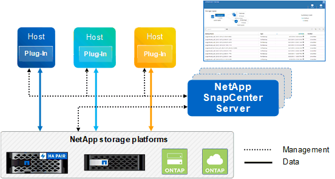

= SnapCenter overview
:icons: font
:imagesdir: ../media/

[.lead]
SnapCenter Software is a simple, centralized, scalable platform that provides application-consistent data protection for applications, databases, host file systems, and VMs running on ONTAP systems anywhere in the Hybrid Cloud.

SnapCenter leverages NetApp Snapshot, SnapRestore, FlexClone, SnapMirror, and SnapVault technologies to provide the following:

* Fast, space-efficient, application-consistent, disk-based backups
* Rapid, granular restore, and application-consistent recovery
* Quick, space-efficient cloning

SnapCenter includes both SnapCenter Server and individual lightweight plug-ins. You can automate deployment of plug-ins to remote application hosts, schedule backup, verification, and clone operations, and monitor all data protection operations.

SnapCenter can be deployed in the following ways:

* On premise to protect the following:
** Data that is on ONTAP FAS or AFF primary systems and replicated to ONTAP FAS or AFF secondary systems
** Data that is on ONTAP Select primary systems
** Data that is on ONTAP FAS or AFF primary & secondary systems and protected to local StorageGRID object storage (using NetApp BlueXP cloud backup integration)

* On premise in a Hybrid Cloud to protect the following:
** Data that is on ONTAP FAS or AFF primary systems and replicated to Cloud Volumes ONTAP
** Data that is on ONTAP FAS or AFF primary and secondary systems and protected to object and archive storage in cloud (using NetApp BlueXP Cloud Backup integration)

* In a public cloud to protect the following:
** Data that is on Cloud Volumes ONTAP (formerly ONTAP Cloud) primary systems
** Data that is on Amazon FSX for ONTAP

SnapCenter includes the following key features:

* Centralized, application-consistent data protection
+
Data protection is supported for Microsoft Exchange Server, Microsoft SQL Server, Oracle Databases on Linux or AIX, SAP HANA database, and Windows Host Filesystems running on ONTAP systems.
+
Data protection is also supported for other standard or custom applications and databases by providing a framework to create user-defined SnapCenter plug-ins. This enables data protection for other applications and databases from the same single-pane-of-glass. By leveraging this framework, NetApp has released SnapCenter custom plug-ins for IBM DB2, MongoDB, MySQL etc. on the NetApp Automation Store.
+
https://automationstore.netapp.com/home.shtml[NetApp Storage Automation Store^]

* Policy-based backups
+
Policy-based backups leverage NetApp Snapshot copy technology to create fast, space-efficient, application-consistent, disk-based backups. Optionally, you can automate protection of these backups to secondary storage by updates to existing protection relationships.

* Back ups for multiple resources
+
You can back up multiple resources (applications, databases, or host file systems) of the same type, at the same time, by using SnapCenter resource groups.

* Restore and recovery
+
SnapCenter provides rapid, granular restores of backups and application-consistent, time-based recovery. You can restore from any destination in the Hybrid Cloud.

* Cloning
+
SnapCenter provides quick, space-efficient, application-consistent cloning, which enables accelerated software development. You can clone on any destination in the Hybrid Cloud.

* Single user management graphical user interface (GUI)
+
The SnapCenter GUI provides a single, one-stop interface for managing backups and clones of a resource in any destination in the Hybrid Cloud.

* REST APIs, Windows cmdlets, UNIX commands
+
SnapCenter includes REST APIs for most functionality for integration with any orchestration software, and use of Windows PowerShell cmdlets and command-line interface.
+
For more information on REST APIs see https://docs.netapp.com/us-en/snapcenter/sc-automation/overview_rest_apis.html[REST API overview].
+
For more information on Windows cmdlets see https://library.netapp.com/ecm/ecm_download_file/ECMLP2885482[SnapCenter Software Cmdlet Reference Guide^].
+
For more information on UNIX commands see https://library.netapp.com/ecm/ecm_download_file/ECMLP2885486[SnapCenter Software Command Reference Guide^].

* Centralized data protection Dashboard and reporting
* Role-Based Access Control (RBAC) for security and delegation.
* Repository database with High Availability
+
SnapCenter provides a built-in repository database with High Availability to store all backup metadata.

* Automated push install of plug-ins
+
You can automate a remote push of SnapCenter plug-ins from the SnapCenter Server host to application hosts.

* High Availability
// Removed load balancing as per Manohar's comments
+
High availability for SnapCenter is set up using external load balancer (F5). Up to two nodes are supported within the same datacenter.
// Changed the description as per Manohar's comments

* Disaster Recovery (DR)
+
You can recover the SnapCenter Server in the event of disasters like resource corruption or server crash.

== SnapCenter architecture

The SnapCenter platform is based on a multitiered architecture that includes a centralized management server (SnapCenter Server) and a SnapCenter plug-in host.

SnapCenter supports multisite data center. The SnapCenter Server and the plug-in host can be at different geographical locations.

== SnapCenter components

SnapCenter consists of the SnapCenter Server and SnapCenter plug-ins. You should install only the plug-ins that are appropriate for the data you want to protect.

* SnapCenter Server
* SnapCenter Plug-ins Package for Windows, which includes the following plug-ins:
 ** SnapCenter Plug-in for Microsoft SQL Server
 ** SnapCenter Plug-in for Microsoft Windows
 ** SnapCenter Plug-in for Microsoft Exchange Server
 ** SnapCenter Plug-in for SAP HANA Database
* SnapCenter Plug-ins Package for Linux, which includes the following plug-ins:
 ** SnapCenter Plug-in for Oracle Database
 ** SnapCenter Plug-in for SAP HANA Database
 ** SnapCenter Plug-in for UNIX
+
NOTE: SnapCenter Plug-in for UNIX is not a standalone plug-in and cannot be installed independently. This plug-in is automatically installed when you install either SnapCenter Plug-in for Oracle Database or SnapCenter Plug-in for SAP HANA Database.

* SnapCenter Plug-ins Package for AIX, which includes the following plug-ins:
 ** SnapCenter Plug-in for Oracle Database
 ** SnapCenter Plug-in for UNIX
+
NOTE: SnapCenter Plug-in for UNIX is not a standalone plug-in and cannot be installed independently. This plug-in is automatically installed when you install SnapCenter Plug-in for Oracle Database.

* SnapCenter Custom Plug-ins
+
Custom plug-ins are community-supported and can be downloaded from the https://automationstore.netapp.com/home.shtml[NetApp Storage Automation Store^].

SnapCenter Plug-in for VMware vSphere, formerly NetApp Data Broker, is a standalone virtual appliance that supports SnapCenter data protection operations on virtualized databases and file systems.

== SnapCenter server

The SnapCenter Server includes a web server, a centralized HTML5-based user interface, PowerShell cmdlets, REST APIs, and the SnapCenter repository.

SnapCenter enables high availability and horizontal scaling across multiple SnapCenter Servers within a single user interface. You can accomplish high availability by using external load balancer (F5). For larger environments with thousands of hosts, adding multiple SnapCenter Servers can help balance the load.

// Updated as per Manohar's comments
* If you are using the SnapCenter Plug-ins Package for Windows, the host agent runs on the SnapCenter Server and Windows plug-in host. The host agent executes the schedules natively on the remote Windows host, or for Microsoft SQL Servers, the schedule is executed on the local SQL instance.
+
The SnapCenter Server communicates with the Windows plug-ins through the host agent.

* If you are using the SnapCenter Plug-ins Package for Linux or the SnapCenter Plug-ins Package for AIX, schedules are executed on the SnapCenter Server as Windows task schedules.
 ** For SnapCenter Plug-in for Oracle Database, the host agent that runs on the SnapCenter Server host communicates with the SnapCenter Plug-in Loader (SPL) that runs on the Linux or AIX host to perform different data protection operations.
 ** For SnapCenter Plug-in for SAP HANA Database and SnapCenter Custom Plug-ins, the SnapCenter Server communicates with these plug-ins through the SCCore agent that runs on the host.

The SnapCenter Server and plug-ins communicate with the host agent using HTTPS.

Information about SnapCenter operations is stored in the SnapCenter repository.

== SnapCenter plug-ins

Each SnapCenter plug-in supports specific environments, databases, and applications.

|===
| Plug-in name | Included in install package | Requires other plug-ins | Installed on host | Platform supported

a|
Plug-in for SQL Server
a|
Plug-ins Package for Windows
a|
Plug-in for Windows
a|
SQL Server host
a|
Windows
a|
Plug-in for Windows
a|
Plug-ins Package for Windows
a|

a|
Windows host
a|
Windows
a|
Plug-in for Exchange
a|
Plug-ins Package for Windows
a|
Plug-in for Windows
a|
Exchange Server host
a|
Windows
a|
Plug-in for Oracle Database
a|
Plug-ins Package for Linux and Plug-ins Package for AIX
a|
Plug-in for UNIX
a|
Oracle host
a|
Linux or AIX
a|
Plug-in for SAP HANA Database
a|
Plug-ins Package for Linux and Plug-ins Package for Windows
a|
Plug-in for UNIX or Plug-in for Windows
a|
HDBSQL client host
a|
Linux or Windows
a|
Custom Plug-ins
a|
https://automationstore.netapp.com/home.shtml[NetApp Storage Automation Store^]
a|
For file system backups, Plug-in for Windows
a|
Custom application host
a|
Linux or Windows
|===
NOTE: The SnapCenter Plug-in for VMware vSphere supports crash-consistent and VM-consistent backup and restore operations for virtual machines (VMs), datastores, and Virtual Machine Disks (VMDKs), and it supports the SnapCenter application-specific plug-ins to protect application-consistent backup and restore operations for virtualized databases and file systems.

For SnapCenter 4.1.1 users, the SnapCenter Plug-in for VMware vSphere 4.1.1 documentation has information on protecting virtualized databases and file systems. For SnapCenter 4.2.x users, the NetApp Data Broker 1.0 and 1.0.1, documentation has information on protecting virtualized databases and file systems using the SnapCenter Plug-in for VMware vSphere that is provided by the Linux-based NetApp Data Broker virtual appliance (Open Virtual Appliance format). For users using SnapCenter 4.3 or later, the https://docs.netapp.com/us-en/sc-plugin-vmware-vsphere/index.html[SnapCenter Plug-in for VMware vSphere documentation^] has information on protecting virtualized databases and file systems using the Linux-based SnapCenter Plug-in for VMware vSphere virtual appliance (Open Virtual Appliance format).

=== SnapCenter Plug-in for Microsoft SQL Server features

* Automates application-aware backup, restore, and clone operations for Microsoft SQL Server databases in your SnapCenter environment.
* Supports Microsoft SQL Server databases on VMDK and raw device mapping (RDM) LUNs when you deploy the SnapCenter Plug-in for VMware vSphere and register the plug-in with SnapCenter
* Supports provisioning SMB shares only. Support is not provided for backing up SQL Server databases on SMB shares.
* Supports importing backups from SnapManager for Microsoft SQL Server to SnapCenter.

=== SnapCenter Plug-in for Microsoft Windows features

* Enables application-aware data protection for other plug-ins that are running in Windows hosts in your SnapCenter environment
* Automates application-aware backup, restore, and clone operations for Microsoft file systems in your SnapCenter environment
* Supports storage provisioning, Snapshot copy consistency, and space reclamation for Windows hosts
+
NOTE: The Plug-in for Windows provisions SMB shares and Windows file systems on physical and RDM LUNs but does not support backup operations for Windows file systems on SMB shares.

=== SnapCenter Plug-in for Microsoft Exchange Server features

* Automates application-aware backup and restore operations for Microsoft Exchange Server databases and Database Availability Groups (DAGs) in your SnapCenter environment
* Supports virtualized Exchange Servers on RDM LUNs when you deploy the SnapCenter Plug-in for VMware vSphere and register the plug-in with SnapCenter

=== SnapCenter Plug-in for Oracle Database features

* Automates application-aware backup, restore, recovery, verify, mount, unmount, and clone operations for Oracle databases in your SnapCenter environment
* Supports Oracle databases for SAP, however, SAP BR*Tools integration is not provided

=== SnapCenter Plug-in for UNIX features

* Enables the Plug-in for Oracle Database to perform data protection operations on Oracle databases by handling the underlying host storage stack on Linux or AIX systems
* Supports Network File System (NFS) and storage area network (SAN) protocols on a storage system that is running ONTAP.
* For Linux systems, Oracle databases on VMDK and RDM LUNs is supported when you deploy the SnapCenter Plug-in for VMware vSphere and register the plug-in with SnapCenter.
* Supports Mount Guard for AIX on SAN filesystems and LVM layout.
* Supports Enhanced Journaled File System (JFS2) with inline logging on SAN filesystems and LVM layout for AIX systems only.
+
SAN native devices, filesystems, and LVM layouts built on SAN devices are supported.
// [SD]: Updated this section for BURT 1391312 in 4.5

=== SnapCenter Plug-in for SAP HANA Database features

* Automates application-aware backup, restore, and cloning of SAP HANA databases in your SnapCenter environment

=== SnapCenter Custom Plug-ins features

* Supports custom plug-ins to manage applications or databases that are not supported by other SnapCenter plug-ins. Custom plug-ins are not provided as part of the SnapCenter installation.
* Supports creating mirror copies of backup sets on another volume and performing disk-to-disk backup replication.
* Supports both Windows and Linux environments. In Windows environments, custom applications via custom plug-ins can optionally utilize SnapCenter Plug-in for Microsoft Windows to take file system consistent backups.

MySQL, DB2, and MongoDB custom plug-in samples for SnapCenter Software can be downloaded from the https://automationstore.netapp.com/home.shtml[NetApp Storage Automation Store^].

NOTE: MySQL, DB2, and MongoDB custom plug-ins are supported via the NetApp communities only.

NetApp supports the capability to create and use custom plug-ins; however, the custom plug-ins you create are not supported by NetApp.

For more information, see link:../protect-scc/concept_develop_a_plug_in_for_your_application.html[Develop a plug-in for your application]

== SnapCenter repository

The SnapCenter repository, sometimes referred to as the NSM database, stores information and metadata for every SnapCenter operation.

MySQL Server repository database is installed by default when you install the SnapCenter Server. If MySQL Server is already installed and you are doing a fresh installation of SnapCenter Server, you should uninstall MySQL Server.

SnapCenter supports MySQL Server 5.7.25 or later as the SnapCenter repository database. If you were using an earlier version of MySQL Server with an earlier release of SnapCenter, during SnapCenter upgrade, the MySQL Server is upgraded to 5.7.25 or later.

The SnapCenter repository stores the following information and metadata:

* Backup, clone, restore, and verification metadata
* Reporting, job, and event information
* Host and plug-in information
* Role, user, and permission details
* Storage system connection information
