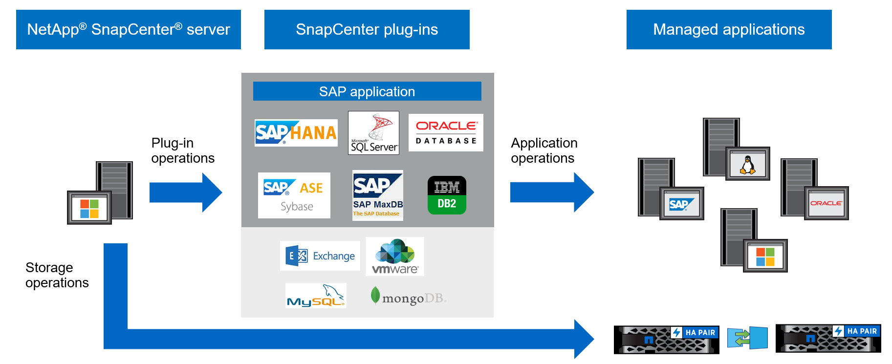

= SnapCenter overview
:icons: font
:imagesdir: ../media/

[.lead]
SnapCenter software is a simple, centralized, and scalable platform for application-consistent data protection. It protects applications, databases, host file systems, and VMs on ONTAP systems in the Hybrid Cloud.

SnapCenter uses NetApp Snapshot, SnapRestore, FlexClone, SnapMirror, and SnapVault technologies to provide:

* Fast, space-efficient, application-consistent, disk-based backups
* Fast, detailed restore, and application-consistent recovery
* Quick, space-efficient cloning

SnapCenter includes SnapCenter Server and lightweight plug-ins. You can automate plug-in deployment to remote application hosts, schedule backup, verification, and clone operations, and monitor data protection operations.

You can install SnapCenter either on on-premises or on a public cloud to protect data.

* On-premises to protect the following:
** Data that is on ONTAP FAS, AFF, or ASA primary systems and replicated to ONTAP FAS, AFF, or ASA secondary systems
** Data that is on ONTAP Select primary systems
** Data that is on ONTAP FAS, AFF, or ASA primary and secondary systems and protected to local StorageGRID object storage 
** Data that is on ONTAP ASA r2 primary and secondary systems

* On-premises in a Hybrid Cloud to protect the following:
** Data that is on ONTAP FAS, AFF, or ASA primary systems and replicated to Cloud Volumes ONTAP
** Data that is on ONTAP FAS, AFF, or ASA primary and secondary systems and protected to object and archive storage in cloud (using BlueXP backup and recovery integration)

* In a public cloud to protect the following:
** Data that is on Cloud Volumes ONTAP (formerly ONTAP Cloud) primary systems
** Data that is on Amazon FSX for ONTAP
** Data that is on primary Azure NetApp Files (Oracle, Microsoft SQL, and SAP HANA)

== Key features

SnapCenter provides the following key features:

* Centralized, application-consistent data protection of different applications
+
Data protection is supported for Microsoft Exchange Server, Microsoft SQL Server, Oracle Databases on Linux or AIX, SAP HANA database, IBM Db2, PostgreSQL, MySQL, and Windows Host Filesystems running on ONTAP systems. SnapCenter also supports protection of applications such as MongoDB, Storage, MaxDB, Sybase ASE, ORASCPM.

* Policy-based backups
+
Policy-based backups leverage NetApp Snapshot technology to create fast, space-efficient, application-consistent, disk-based backups. You can also set up automatic protection of these backups to secondary storage by updating existing protection relationships.

* Backups for multiple resources
+
You can back up multiple resources (applications, databases, or host file systems) of the same type at once using SnapCenter resource groups.

* Restore and recovery
+
SnapCenter provides rapid, granular restores of backups and application-consistent, time-based recovery. You can restore from any destination in the Hybrid Cloud.

* Cloning
+
SnapCenter provides quick, space-efficient, and application-consistent cloning. You can clone on any destination in the Hybrid Cloud.

* Single user management graphical user interface
+
SnapCenter provides a single interface to manage backups and clones in any Hybrid Cloud destination.

* REST APIs, Windows cmdlets, UNIX commands
+
SnapCenter provides REST APIs for most functionality for integration with any orchestration software, and use of Windows PowerShell cmdlets and command-line interface.

* Centralized data protection dashboard and reporting
* Role-Based Access Control (RBAC) for security and delegation
* A built-in repository database with high-availability to store all backup metadata
* Automated push install of plug-ins
* High Availability
* Disaster Recovery (DR)
* SnapLock https://docs.netapp.com/us-en/ontap/snaplock/[Learn More]
* SnapMirror active sync (initially released as SnapMirror Business Continuity [SM-BC])
* Synchronous mirroring https://docs.netapp.com/us-en/e-series-santricity/sm-mirroring/overview-mirroring-sync.html[Learn More]

== SnapCenter architecture and components

SnapCenter uses a layered design with a central management server and plug-in hosts. The server and plug-in hosts can be in different locations.

SnapCenter includes the SnapCenter Server, the SnapCenter Plug-in package for Windows, and the SnapCenter Plug-In Package for Linux. Each package contains plug-ins for various applications and infrastructure components.

=== SnapCenter Server

The SnapCenter Server supports Microsoft Windows and Linux (RHEL 8.x, RHEL 9.x, SLES 15 SP5) operating systems. SnapCenter server includes a web server, a centralized HTML5-based user interface, PowerShell cmdlets, REST APIs, and the SnapCenter repository.

SnapCenter stores information about its operations in the SnapCenter repository.

=== SnapCenter plug-ins

Each SnapCenter plug-in supports specific environments, databases, and applications.

|===
| Plug-in name | Included in install package | Requires other plug-ins | Installed on host | Platform supported

a|
SnapCenter plug-in for Microsoft SQL Server
a|
Plug-ins package for Windows
a|
Plug-in for Windows
a|
SQL Server host
a|
Windows
a|
SnapCenter plug-in for Windows
a|
Plug-ins package for Windows
a|

a|
Windows host
a|
Windows
a|
SnapCenter plug-in for Microsoft Exchange Server
a|
Plug-ins package for Windows
a|
Plug-in for Windows
a|
Exchange Server host
a|
Windows
a|
SnapCentre plug-in for Oracle Database
a|
Plug-ins package for Linux and plug-ins Package for AIX
a|
Plug-in for UNIX
a|
Oracle host
a|
Linux or AIX
a|
SnapCenter plug-in for SAP HANA Database
a|
Plug-ins package for Linux and plug-ins package for Windows
a|
Plug-in for UNIX or plug-in for Windows
a|
HDBSQL client host
a|
Linux or Windows
a|
SnapCenter plug-in for IBM Db2
a|
Plug-ins package for Linux and plug-ins Package for Windows
a|
Plug-in for UNIX or plug-in for Windows
a|
Db2 host
a|
Linux, AIX, or Windows
a|
SnapCenter plug-in for PostgreSQL
a|
Plug-ins package for Linux and plug-ins package for Windows
a|
Plug-in for UNIX or plug-in for Windows
a|
PostgreSQL host
a|
Linux or Windows
a|
SnaoCenter plug-in for MySQL
a|
Plug-ins package for Linux and plug-ins package for Windows
a|
Plug-in for UNIX or Plug-in for Windows
a|
MySQL host
a|
Linux or Windows
a|
SnapCenter plug-in for MongoDB
a|
Plug-ins package for Linux and plug-ins package for Windows
a|
Plug-in for UNIX or plug-in for Windows
a|
MongoDB host
a|
Linux or Windows
a|
SnapCenter plug-in for ORASCPM (Oracle Applications)
a|
Plug-ins package for Linux and plug-ins package for Windows
a|
Plug-in for UNIX or plug-in for Windows
a|
Oracle host
a|
Linux or Windows
a|
SnapCenter plug-in for SAP ASE
a|
Plug-ins package for Linux and plug-ins package for Windows
a|
Plug-in for UNIX or plug-in for Windows
a|
SAP host
a|
Linux or Windows
a|
SnapCenter plug-in for SAP MaxDB
a|
Plug-ins package for Linux and plug-ins package for Windows
a|
Plug-in for UNIX or plug-in for Windows
a|
SAP MaxDB host
a|
Linux or Windows
a|
SnapCenter plug-in for Storage plug-in
a|
Plug-ins package for Linux and Plug-ins package for Windows
a|
Plug-in for UNIX or plug-in for Windows
a|
Storage host
a|
Linux or Windows
|===

The SnapCenter Plug-in for VMware vSphere supports crash-consistent and VM-consistent backup and restore operations for virtual machines (VMs), datastores, and Virtual Machine Disks (VMDKs). It also supports application-consistent backup and restore operations for virtualized databases and file systems.

To protect databases, filesystems, VMs, or datastores on VMs, deploy the SnapCenter Plug-in for VMware vSphere appliance. For information, refer https://docs.netapp.com/us-en/sc-plugin-vmware-vsphere/index.html[SnapCenter Plug-in for VMware vSphere documentation^].

=== SnapCenter repository

The SnapCenter repository, sometimes referred to as the NSM database, stores information and metadata for every SnapCenter operation.

The SnapCenter Server installation installs the MySQL Server repository database by default. If you have already installed MySQL Server and want to perform a fresh installation of SnapCenter Server, you must uninstall MySQL Server.

SnapCenter supports MySQL Server 8.0.37 or later as the SnapCenter repository database. If you use an earlier version of MySQL Server with an earlier release of SnapCenter, the SnapCenter upgrade process upgrades MySQL Server to version 8.0.37 or later.

The SnapCenter repository stores the following information and metadata:

* Backup, clone, restore, and verification metadata
* Reporting, job, and event information
* Host and plug-in information
* Role, user, and permission details
* Storage system connection information
