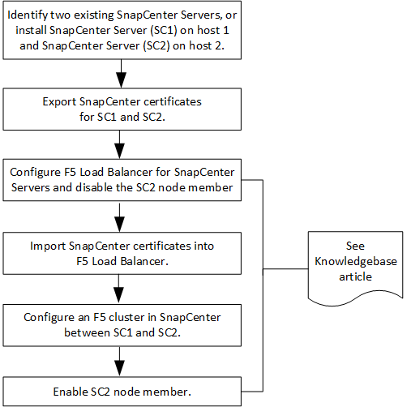

= Configure SnapCenter Servers for High Availability using F5
:icons: font
:imagesdir: ../media/

[.lead]
To support High Availability (HA) in SnapCenter, you can install the F5 load balancer. F5 enables the SnapCenter Server to support active-passive configurations in up to two hosts that are in the same location. To use F5 Load Balancer in SnapCenter, you should configure the SnapCenter Servers and configure F5 load balancer.

IMPORTANT: If you have upgraded from SnapCenter 4.2.x and were previously using Network Load Balancing (NLB), you can continue to use that configuration or switch to F5. link:../install/concept_configure_snapcenter_servers_for_high_availabiity_using_f5.html[Learn more^]

https://kb.netapp.com/Advice_and_Troubleshooting/Data_Protection_and_Security/SnapCenter/How_to_configure_SnapCenter_Servers_for_high_availability_using_F5_Load_Balancer[How to configure SnapCenter Servers for high availability using F5 Load Balancer^]

You must be a member of the Local Administrators group on the SnapCenter Servers (in addition to being assigned to the SnapCenterAdmin role) to use the following cmdlets for adding and removing F5 clusters:

* Add-SmServerCluster
* Add-SmServer
* Remove-SmServerCluster

For more information, see https://library.netapp.com/ecm/ecm_download_file/ECMLP2877143[SnapCenter Software Cmdlet Reference Guide^].

Additional F5 configuration information:

* After you install and configure SnapCenter for high availability, edit the SnapCenter desktop shortcut to point to the F5 cluster IP.
* If a failover occurs between SnapCenter Servers and if there is also an existing SnapCenter session, you must close the browser and log on to SnapCenter again.
