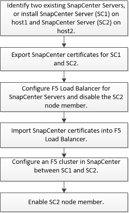

= Configure SnapCenter Servers for High Availability
:icons: font
:imagesdir: ../media/

[.lead]
To support High Availability (HA) in SnapCenter running either on Windows or on Linux, you can install the F5 load balancer. F5 enables the SnapCenter Server to support active-passive configurations in up to two hosts that are in the same location. To use F5 Load Balancer in SnapCenter, you should configure the SnapCenter Servers and configure F5 load balancer.

You can also configure Microsoft Network Load Balancing (NLB) to set up SnapCenter High Availability. You should manually configure NLB outside of SnapCenter installation for high availability.

For cloud environment, you can configure high availability consisting of two SnapCenter servers in two availability zones using Amazon Web Services (AWS). 

NOTE: SnapCenter also supports AWS Elastic Load Balancing (ELB) and Azure load balancing.

[role="tabbed-block"]
====

.Configure high availability using F5
--

The workflow image lists the steps to configure SnapCenter Servers for high availability using F5 load balancer. For detailed instruction, see https://kb.netapp.com/Advice_and_Troubleshooting/Data_Protection_and_Security/SnapCenter/How_to_configure_SnapCenter_Servers_for_high_availability_using_F5_Load_Balancer[How to configure SnapCenter Servers for high availability using F5 Load Balancer^].

You must be a member of the Local Administrators group on the SnapCenter Servers (in addition to being assigned to the SnapCenterAdmin role) to use the following cmdlets for adding and removing F5 clusters:

* Add-SmServerCluster
* Add-SmServer
* Remove-SmServerCluster
+
For more information, see https://docs.netapp.com/us-en/snapcenter-cmdlets/index.html[SnapCenter Software Cmdlet Reference Guide^].

Additional information

* After you install and configure SnapCenter for high availability, edit the SnapCenter desktop shortcut to point to the F5 cluster IP.
* If a failover occurs between SnapCenter Servers and if there is also an existing SnapCenter session, you must close the browser and log on to SnapCenter again.
* In load balancer setup (NLB or F5), if you add a node that is partially resolved by the NLB or F5 node and if the SnapCenter node is not able to reach out to this node, then the SnapCenter host page switches between hosts down and running state frequently. To resolve this issue, you should ensure that both the SnapCenter nodes are able to resolve the host in NLB or F5 node.
* SnapCenter commands for MFA settings should be executed on all the nodes. Relying party configuration should be done in the Active Directory Federation Services (AD FS) server using F5 cluster details.  Node level SnapCenter UI access will be blocked after MFA is enabled. 
* During failover, the audit log settings will not reflect on the second node.  Hence, you should manually repeat the audit log settings on F5 passive node when it becomes active. 
--

.Configure high availability using Network Load Balancing (NLB)
--

You can configure Microsoft Network Load Balancing (NLB) to set up SnapCenter High Availability. You should manually configure NLB outside of SnapCenter installation for high availability.

For information about how to configure Network Load Balancing (NLB) with SnapCenter see https://kb.netapp.com/Advice_and_Troubleshooting/Data_Protection_and_Security/SnapCenter/How_to_configure_NLB_and_ARR_with_SnapCenter[How to configure NLB with SnapCenter^].
--

.Configure high availability using Amazon Web Services (AWS)
--

.Steps

. Configure virtual private overlay IP in AWS. For information, see https://docs.aws.amazon.com/vpc/latest/userguide/replace-local-route-target.html[Configure virtual private overlay IP].
. Prepare your Windows host
.. Force IPv4 being prioritized above IPv6:
+
* Location: HKLM\SYSTEM\CurrentControlSet\Services\Tcpip6\Parameters
* Key: DisabledComponents
* Type: REG_DWORD
* Value: 0x20
.. Ensure that the fully qualified domain names can be resolved via DNS or via local host configuration to the IPv4 addresses.
.. Ensure that you do not have a system proxy configured.
.. Ensure that the administrator password is same on both the Windows Server when using a setup without an Active Directory and the servers are not in one domain.
.. Add virtual IP on both Windows Servers.
. Create the SnapCenter cluster.
.. Start Powershell and connect to SnapCenter.
`Open-SmConnection`
.. Create the cluster.
`Add-SmServerCluster -ClusterName <cluster_name> -ClusterIP <cluster_ip> -PrimarySCServerIP <primary_ip> -Verbose -Credential administrator`
.. Add the secondary server.
`Add-SmServer -ServerName <server_name> -ServerIP <server_ip> -CleanUpSecondaryServer -Verbose -Credential administrator`
.. Get the high availability details.
`Get-SmServerConfig`
. Create the Lamda function. For information, see https://docs.aws.amazon.com/lambda/latest/dg/getting-started.html#getting-started-create-function[Create a Lambda function].
. Create a monitor in CloudWatch. For information, see https://docs.aws.amazon.com/AmazonCloudWatch/latest/monitoring/CloudWatch_Synthetics_Canaries_Create.html[Create synthetic canaries].
. Implement workflow using a step function.
.. Use a lambda function for probing the SnapCenter URL. For information, see https://docs.aws.amazon.com/lambda/latest/dg/getting-started.html[Create Lambda function].
.. Create a DynamoDB table for storing the failure count between two Step Function iterations. For information, see https://docs.aws.amazon.com/amazondynamodb/latest/developerguide/GettingStartedDynamoDB.html[Get started with DynamoDB table].
.. Create the Step Function. For information, see https://docs.aws.amazon.com/step-functions/[Step Function documentation].
.. Test a single step.
.. Test the complete function.
.. Create IAM Role and adjust permissions to be allowed to execute Lambda function.
.. Create schedule to trigger Step Function. For information, see https://docs.aws.amazon.com/step-functions/latest/dg/using-eventbridge-scheduler.html[Using Amazon EventBridge Scheduler to start a Step Functions].
--

== Switch from NLB to F5 for high availability

You can change your SnapCenter HA configuration from Network Load Balancing (NLB) to use F5 Load Balancer.

*Steps*

. Configure SnapCenter Servers for high availability using F5. https://kb.netapp.com/Advice_and_Troubleshooting/Data_Protection_and_Security/SnapCenter/How_to_configure_SnapCenter_Servers_for_high_availability_using_F5_Load_Balancer[Learn more^].
. On the SnapCenter Server host, launch PowerShell.
. Start a session by using the Open-SmConnection cmdlet, and then enter your credentials.
. Update the SnapCenter Server to point to the F5 cluster IP address using the Update-SmServerCluster cmdlet.
+
The information regarding the parameters that can be used with the cmdlet and their descriptions can be obtained by running _Get-Help command_name_. Alternatively, you can also refer to the https://docs.netapp.com/us-en/snapcenter-cmdlets/index.html[SnapCenter Software Cmdlet Reference Guide^].
