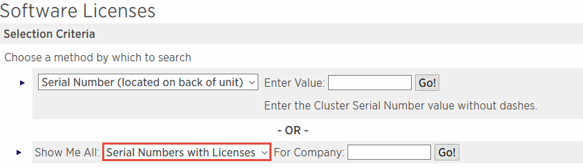

= Add SnapCenter Standard capacity-based licenses
:icons: font
:imagesdir: ../media/

[.lead]
You use a SnapCenter Standard capacity license to protect data on ONTAP Select and Cloud Volumes ONTAP platforms.

A capacity license has the following characteristics:

* Composed of a nine-digit serial number with the format 51xxxxxxx
+
You use the license serial number and valid NetApp Support Site login credentials to enable the license using the SnapCenter GUI.

* Available as a separate, perpetual license, with the cost based on either the used storage capacity or the size of the data you want protected, whichever is lower, and the data is managed by SnapCenter
* Available per terabyte
+
For example, you can obtain a capacity-based license for 1 TB, 2 TBs, 4 TBs, and so on.

* Available as a 90-day trial license with 100 TB capacity entitlement
+
For information on the licenses required, see link:../install/concept_snapcenter_licenses.html[SnapCenter licenses^].

SnapCenter automatically calculates capacity usage once a day at midnight on the ONTAP Select and Cloud Volumes ONTAP storage it manages. When you are using a Standard Capacity license, SnapCenter calculates the unused capacity by deducting the used capacity on all volumes from the total licensed capacity. If used capacity exceeds the licensed capacity, an overuse warning is displayed on the SnapCenter Dashboard. If you configured capacity thresholds and notifications in SnapCenter, an email is sent when the used capacity reaches the threshold you specify.

=== Step 1: Calculate capacity requirements

Before you obtain a SnapCenter capacity-based license, you should calculate the amount of capacity on a host that is to be managed by SnapCenter.

You should be a cluster administrator on the Cloud Volumes ONTAP or ONTAP Select system.

.About this task

SnapCenter calculates the actual capacity used. If the size of the file system or database is 1 TB, but only 500 GB of space is used, SnapCenter calculates 500 GB of used capacity. The volume capacity is calculated after dedupe and compression, and it is based on the entire volume's used capacity.

.Steps

. Log in to the NetApp controller using the ONTAP command line.
. To view the volume capacity used, enter the command.
+
----
select::> vol show -fields used -volume Engineering,Marketing
vserver volume       used
------- ------       ------
VS1     Engineering  2.13TB
VS1     Marketing    2.62TB

2	entries were displayed.
----
+
The combined used capacity for the two volumes is less than 5 TB; therefore, if you want to protect all 5 TB of data, the minimum SnapCenter capacity-based license requirement is 5 TB.
+
However, if you want to protect only 2 TB of the 5 TB of total used capacity, you can acquire a 2 TB capacity-based license.

=== Step 2: Retrieve the serial number of capacity-based license

Your SnapCenter capacity-based license serial number is available in your order confirmation or in your documentation package; however, if you do not have this serial number, you can retrieve it from the NetApp Support Site.

You should have valid NetApp Support Site login credentials.

.Steps

. Log in to the http://mysupport.netapp.com/[NetApp Support Site^].
. Navigate to *Systems* > *Software Licenses*.
. In the Selection Criteria area, choose *SC_STANDARD* from the Show Me All: Serial Numbers and Licenses drop-down menu.
+

. Type your company name, and then select *Go!*.
+
The nine-digit SnapCenter license serial number, with the format 51xxxxxxx, is displayed.

. Record the serial number.

=== Step 3: Generate a NetApp license file

If you do not want to enter your NetApp Support Site credentials and the SnapCenter license serial number in the SnapCenter GUI, or if you do not have internet access to the NetApp Support Site from SnapCenter, you can generate a NetApp license file (NLF). You can then download and store the file in a location accessible from the SnapCenter host.

.What you'll need

* You should be using SnapCenter with either ONTAP Select or Cloud Volumes ONTAP.
* You should have a valid NetApp Support Site login credentials.
* You should have your nine-digit serial number of the license in the format 51xxxxxxx.

.Steps

. Navigate to the https://register.netapp.com/register/eclg.xwic[NetApp License File Generator^].
. Enter the required information.
. In the Product Line field, select *SnapCenter Standard (capacity-based)* from the pull-down menu.
. In the Product Serial Number field, enter the SnapCenter license serial number
. Read and accept the NetApp Data Privacy Policy, and then select *Submit*.
. Save the license file, and then record the file location.

=== Step 4: Add capacity-based license

If you are using SnapCenter with ONTAP Select or Cloud Volumes ONTAP platforms, you should install one or more SnapCenter capacity-based licenses.

.What you'll need

* You should log in as the SnapCenter Admin user.
* You should have a valid NetApp Support Site login credentials.
* You should have your nine-digit serial number of the license in the format 51xxxxxxx.
+
If you are using a NetApp license file (NLF) to add your license, you should know the location of the license file.

.About this task

You can perform the following tasks in the Settings page:

* Add a license.
* View license details to quickly locate information about each license.
* Modify a license when you want to replace the existing license, for example, to update the license capacity or to change the threshold notification settings.
* Delete a license when you want to replace an existing license or when the license is no longer required.
+
NOTE: The trial license (serial number ending with 50) cannot be deleted using the SnapCenter GUI. The trial license automatically gets overwritten when you add a procured SnapCenter Standard capacity-based licensed.

.Steps

. In the left navigation pane, select *Settings*.
. In the Settings page, select *Software*.
. In the License section of the Software page, select *Add* (image:../media/add_policy_from_resourcegroup.gif[A plus icon]).
. In the Add SnapCenter License wizard, select one of the following methods to obtain the license you want to add:
+
|===
| For this field... | Do this...

a|
Enter your NetApp Support Site (NSS) login credentials to import licenses
a|
 .. Enter your NSS user name.
 .. Enter your NSS password.
 .. Enter the serial number of the controller-based license.

a|
NetApp License File
a|
 .. Browse to the location of the license file, and then select it.
 .. Select *Open*.
|===

. In the Notifications page, enter the capacity threshold at which SnapCenter sends email, EMS, and AutoSupport notifications.
+
The default threshold is 90 percent.

. To configure the SMTP server for email notifications, select *Settings* > *Global Settings* > *Notification Server Settings*, and then enter the following details:
+
|===
| For this field... | Do this...

a|
Email preference
a|
Choose either *Always* or *Never*.
a|
Provide email settings
a|
If you select *Always*, specify the following:

 ** Sender email address
 ** Receiver email address
 ** Optional: Edit the default Subject line
+
The default subject reads as follows: "SnapCenter License Capacity Notification".
|===

. If you want to have Event Management System (EMS) messages sent to the storage system syslog or have AutoSupport messages sent to the storage system for failed operations, select the appropriate check boxes.
+
NOTE: Enabling AutoSupport is recommended to help troubleshoot issues you might experience.

. Select *Next*.
. Review the summary, and then select *Finish*.

