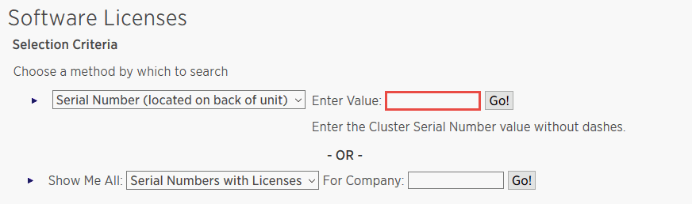

= Add SnapCenter Standard controller-based licenses
:icons: font
:imagesdir: ../media/

[.lead]
A SnapCenter Standard controller-based license is required if you are using FAS, AFF, or ASA storage controllers.

The controller-based license has the following characteristics:

* SnapCenter Standard entitlement included with purchase of Premium or Flash Bundle (not with the base pack)
* Unlimited storage usage
* Enabled by adding it directly to the FAS, AFF, or ASA storage controller by using either ONTAP System Manager or the ONTAP CLI.
+
NOTE: You do not enter any license information in the SnapCenter GUI for the SnapCenter controller-based licenses.

* Locked to the controller's serial number

For information on the licenses required, see link:../install/concept_snapcenter_licenses.html[SnapCenter licenses^].

== Step 1: Verify if the SnapManager Suite license is installed

You can use the SnapCenter GUI to view whether a SnapManager Suite license is installed on FAS, AFF, or ASA primary storage systems, and to identify which storage systems might require SnapManager Suite licenses. SnapManager Suite licenses apply only to FAS, AFF, and ASA SVMs or clusters on primary storage systems.

NOTE: If you already have a SnapManager Suite license on your controller, SnapCenter Standard controller-based license entitlement is provided automatically. The names SnapManagerSuite license and SnapCenter Standard controller-based license are used interchangeably, but they refer to the same license.

.Steps

. In the left navigation pane, select *Storage Systems*.
. In the Storage Systems page, from the *Type* drop-down, select whether to view all the SVMs or clusters that were added:
 ** To view all of the SVMs that were added, select *ONTAP SVMs*.
 ** To view all of the clusters that were added, select *ONTAP Clusters*.
+
When you select the cluster name, all of the SVMs that are part of the cluster are displayed in the Storage Virtual Machines section.
. In the Storage Connections list, locate the Controller License column.
+
The Controller License column displays the following status:

*  indicates that a SnapManager Suite license is installed on a FAS, AFF, or ASA primary storage system.
*  indicates that a SnapManager Suite license is not installed on a FAS, AFF, or ASA primary storage system.
* Not applicable indicates that a SnapManager Suite license is not applicable because the storage controller is on Amazon FSx for NetApp ONTAP, Cloud Volumes ONTAP, ONTAP Select, or Secondary storage platforms.

== Step 2: Identify the licenses installed on the controller

You can use the ONTAP command line to view all the licenses installed on your controller. You should be a cluster administrator on the FAS, AFF, or ASA system.

NOTE: The SnapCenter Standard controller-based license is displayed as SnapManagerSuite license on the controller.

.Steps

. Log in to the NetApp controller using the ONTAP command line.
. Enter the license show command, and then view the output to determine whether the SnapManagerSuite license is installed.
+
.Example output
[%collapsible]
====
----
cluster1::> license show
(system license show)

Serial Number: 1-80-0000xx
Owner: cluster1
Package           Type     Description              Expiration
----------------- -------- ---------------------    ---------------
Base              site     Cluster Base License     -

Serial Number: 1-81-000000000000000000000000xx
Owner: cluster1-01
Package           Type     Description              Expiration
----------------- -------- ---------------------    ---------------
NFS               license  NFS License              -
CIFS              license  CIFS License             -
iSCSI             license  iSCSI License            -
FCP               license  FCP License              -
SnapRestore       license  SnapRestore License      -
SnapMirror        license  SnapMirror License       -
FlexClone         license  FlexClone License        -
SnapVault         license  SnapVault License        -
SnapManagerSuite  license  SnapManagerSuite License -
----
====
+
In the example, the SnapManagerSuite license is installed, therefore, no additional SnapCenter licensing action is required.

== Step 3: Retrieve the controller serial number

You need to have the controller serial number to retrieve the serial number of your controller-based license. You can retrieve the controller serial number using the ONTAP command line. You should be a cluster administrator on the FAS, AFF, or ASA system.

.Steps

. Log in to the controller using the ONTAP command line.
. Enter the system show -instance command, and then review the output to locate the controller serial number.
+
.Example output
[%collapsible]
====
----
cluster1::> system show -instance

Node: fasxxxx-xx-xx-xx
Owner:
Location: RTP 1.5
Model: FAS8080
Serial Number: 123451234511
Asset Tag: -
Uptime: 143 days 23:46
NVRAM System ID: xxxxxxxxx
System ID: xxxxxxxxxx
Vendor: NetApp
Health: true
Eligibility: true
Differentiated Services: false
All-Flash Optimized: false

Node: fas8080-41-42-02
Owner:
Location: RTP 1.5
Model: FAS8080
Serial Number: 123451234512
Asset Tag: -
Uptime: 144 days 00:08
NVRAM System ID: xxxxxxxxx
System ID: xxxxxxxxxx
Vendor: NetApp
Health: true
Eligibility: true
Differentiated Services: false
All-Flash Optimized: false
2 entries were displayed.
----
====
. Record the serial numbers.

== Step 4: Retrieve the serial number of the controller-based license

If you are using FAS, ASA, or AFF storage, you can retrieve the SnapCenter controller-based license from the NetApp Support Site before you can install it using the ONTAP command line.

.Before you begin

* You should have a valid NetApp Support Site login credentials.
+
If you do not enter valid credentials, no information is returned for your search.

* You should have the controller serial number.

.Steps

. Log in to the http://mysupport.netapp.com/[NetApp Support Site^].
. Navigate to *Systems* > *Software Licenses*.
. In the Selection Criteria area, ensure Serial Number (located on back of unit) is selected, enter the controller serial number, and then select *Go!*.
+

+
A list of licenses for the specified controller is displayed.
. Locate and record the SnapCenter Standard or SnapManagerSuite license.

== Step 5: Add controller-based license

You can use the ONTAP command line to add a SnapCenter controller-based license when you are using FAS, AFF, or ASA systems, and you have a SnapCenter Standard or SnapManagerSuite license.

.Before you begin

* You should be a cluster administrator on the FAS, AFF, or ASA system.
* You should have the SnapCenter Standard or SnapManagerSuite license.

.About this task

If you want to install SnapCenter on a trial basis with FAS, AFF, or ASA storage, you can obtain a Premium Bundle evaluation license to install on your controller.

If you want to install SnapCenter on a trial basis, you should contact your sales representative to obtain a Premium Bundle evaluation license to install on your controller.

.Steps

. Log in to the NetApp cluster using the ONTAP command line.
. Add the SnapManagerSuite license key:
+
`system license add -license-code license_key`
+
This command is available at the admin privilege level.
. Verify that the SnapManagerSuite license is installed:
+
`license show`

== Step 6: Remove the trial license

If you are using a controller-based SnapCenter Standard license and need to remove the capacity-based trial license (serial number ending with "`50`"), you should use MySQL commands to remove the trial license manually. The trial license cannot be deleted using the SnapCenter GUI.

NOTE: Removing a trial license manually is only required if you are using a SnapCenter Standard controller-based license.

.Steps

. On the SnapCenter Server, open a PowerShell window to reset the MySQL password.
 .. Run the Open-SmConnection cmdlet to initiate a connection session with the SnapCenter Server for a SnapCenterAdmin account.
 .. Run the Set-SmRepositoryPassword to reset the MySQL password.
+
For information about the cmdlets, see https://library.netapp.com/ecm/ecm_download_file/ECMLP2886205[SnapCenter Software Cmdlet Reference Guide^].
. Open the command prompt and run mysql -u root -p to log into MySQL.
+
MySQL prompts you for the password. Enter the credentials you provided while resetting the password.

. Remove the trial license from the database:
+
`use nsm;``DELETE FROM nsm_License WHERE nsm_License_Serial_Number='510000050';`
