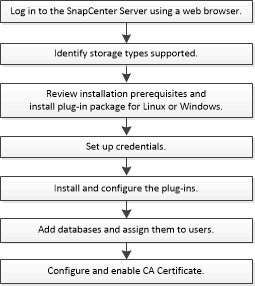

= Installation workflow of SnapCenter Plug-in for SAP HANA Database
:icons: font
:imagesdir: ../media/

[.lead]
You should install and set up the SnapCenter Plug-in for SAP HANA Database if you want to protect SAP HANA databases.

