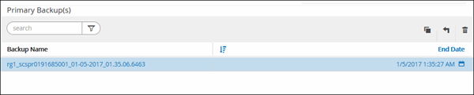

= Restore and recover an auto discovered database backup
:icons: font
:imagesdir: ../media/

[.lead]
You can use SnapCenter to restore and recover data from one or more backups.

.Before you begin

* You must have backed up the resource or resource groups.
* You must have canceled any backup operation that is currently in progress for the resource or resource group that you want to restore.
* For pre restore, post restore, mount, and unmount commands, you should check if the commands exist in the command list available on the plug-in host from the following paths:
+
For Windows: _C:\Program Files\NetApp\SnapCenter\Snapcenter Plug-in Creator\etc\allowed_commands_list.txt_
+
For Linux: _/var/opt/snapcenter/scc/allowed_commands_list.txt_
+
NOTE: If the commands do not exist in the command list, then the operation will fail.

.About this task

* File-based backup copies cannot be restored from SnapCenter.
* For Auto-discovered resources, restore is supported with SFSR.
* Auto-recovery is not supported.
* For ONTAP 9.12.1 and below version, the clones created from the SnapLock Vault snapshots as part of restore will inherit the SnapLock Vault expiry time. Storage admin should manually cleanup the clones post the SnapLock expiry time.

.Steps

. In the left navigation pane, click *Resources*, and then select the appropriate plug-in from the list.
. In the Resources page, filter resources from the *View* drop-down list based on resource type.
+
The resources are displayed along with type, host, associated resource groups and policies, and status.
+
NOTE: Although a backup might be for a resource group, when you restore, you must select the individual resources you want to restore.
+
If the resource is not protected, "`Not protected`" is displayed in the Overall Status column. This can mean either that the resource is not protected, or that the resource was backed up by a different user.

. Select the resource, or select a resource group and then select a resource in that group.
+
The resource topology page is displayed.

. From the Manage Copies view, select *Backups* either from the primary or secondary (mirrored or vaulted) storage systems.
. In the Primary backup(s) table, select the backup that you want to restore from, and then click **.
+

. In the Restore Scope page, select *Complete Resource* to restore the configured data volumes of the IBM database.

. In the Pre ops page, enter pre restore and unmount commands to run before performing a restore job.
+
Unmount commands are not available for auto discovered resources.

. In the Post ops page, enter mount and post restore commands to run after performing a restore job.
+
Mount commands are not available for auto discovered resources.
+
NOTE: For pre and post commands for quiesce, snapshot, and unquiesce operations, you should check if the commands exist in the command list available on the plug-in host from the _/opt/snapcenter/snapenter/scc/allowed_commands.config_ path for Linux and _C:\Program Files\NetApp\SnapCenter\Snapcenter Plug-in Creator\etc\allowed_commands_list.txt_ for Windows.

. In the Notification page, from the *Email preference* drop-down list, select the scenarios in which you want to send the emails.
+
You must also specify the sender and receiver email addresses and the subject of the email. SMTP must also be configured on the *Settings* > *Global Settings* page.

. Review the summary, and then click *Finish*.
. Monitor the operation progress by clicking *Monitor* > *Jobs*.
