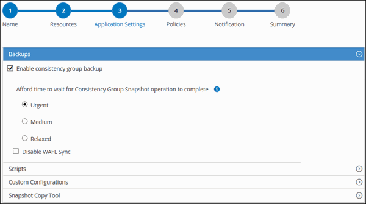

= Back up SAP HANA databases
:icons: font
:imagesdir: ../media/

[.lead]
If a resource is not yet part of any resource group, you can back up the resource from the Resources page.

*What you will need*

* You must have created a backup policy.
* If you want to back up a resource that has a SnapMirror relationship with a secondary storage, the ONTAP role assigned to the storage user should include the "`snapmirror all`" privilege. However, if you are using the "`vsadmin`" role, then the "`snapmirror all`" privilege is not required.
* For Snapshot copy based backup operation, ensure that all the tenant databases are valid and active.
* To create SAP HANA system replication backups, it is recommended to add all the resources of the SAP HANA system into one resource group. This ensures a seamless backup during takeover-failback mode.
+
link:task_create_resource_groups_and_attach_policies.html[Create resource groups and attach policies].
+
link:task_back_up_resource_groups_sap_hana.html[Back up resource groups]

* If you want to create a file-based backup when one or more tenant databases are down, set the ALLOW_FILE_BASED_BACKUP_IFINACTIVE_TENANTS_PRESENT parameter to *YES* in the HANA properties file using `Set-SmConfigSettings` cmdlet.
+
The information regarding the parameters that can be used with the cmdlet and their descriptions can be obtained by running Get-Help _command_name_. Alternatively, you can also refer to the https://library.netapp.com/ecm/ecm_download_file/ECMLP2886205[SnapCenter Software Cmdlet Reference Guide]

* For pre and post commands for quiesce, Snapshot copy, and unquiesce operations, you should check if the commands exist in the command list available on the plug-in host from the following paths:
+
For Windows: _C:\Program Files\NetApp\SnapCenter\Snapcenter Plug-in Creator\etc\allowed_commands_list.txt_
+
For Linux: _/var/opt/snapcenter/scc/allowed_commands_list.txt_

NOTE: If the commands do not exist in the command list, then the operation will fail.

*Steps*

. In the left navigation pane, click *Resources*, and then select the appropriate plug-in from the list.
. In the Resource page, filter resources from the *View* drop-down list based on resource type.
+
Click **, and then select the host name and the resource type to filter the resources. You can then click  to close the filter pane.

. Click the resource that you want to back up.
. In the Resource page, select *Use custom name format for Snapshot copy*, and then enter a custom name format that you want to use for the Snapshot copy name.
+
For example, _customtext_policy_hostname_ or _resource_hostname_. By default, a timestamp is appended to the Snapshot copy name.

. In the Application Settings page, do the following:
 ** Click the *Backups* arrow to set additional backup options:
+
Enable consistency group backup, if needed, and perform the following tasks:
+
|===
| For this field...| Do this...

a|
Afford time to wait for "Consistency Group Snapshot" operation to complete
a|
Select *Urgent*, or *Medium*, or *Relaxed* to specify the wait time for Snapshot copy operation to finish.         Urgent = 5 seconds, Medium = 7 seconds, and Relaxed = 20 seconds.
a|
Disable WAFL Sync
a|
Select this to avoid forcing a WAFL consistency point.
|===

 ** Click the *Scripts* arrow to run pre and post commands for quiesce, Snapshot copy, and unquiesce operations.
+
You can also run pre commands before exiting the backup operation. Prescripts and postscripts are run in the SnapCenter Server.

 ** Click the **Custom Configurations**arrow, and then enter the custom value pairs required for all jobs using this resource.
 ** Click the *Snapshot Copy Tool* arrow to select the tool to create Snapshot copies:
+
|===
| If you want...| Then...

a|
SnapCenter to create a storage-level Snapshot copy
a|
Select *SnapCenter without File System Consistency*.
a|
SnapCenter to use the plug-in for Windows to put the file system into a consistent state and then create a Snapshot copy
a|
Select *SnapCenter with File System Consistency*.
a|
To enter the command to create a Snapshot copy
a|
Select *Other*, and then enter the command to create a Snapshot copy.
|===

. In the Policies page, perform the following steps:
 .. Select one or more policies from the drop-down list.
+
NOTE: You can also create a policy by clicking *image:../media/add_policy_from_resourcegroup.gif[]*.
+
In the Configure schedules for selected policies section, the selected policies are listed.

 .. Click *image:../media/add_policy_from_resourcegroup.gif[]* in the Configure Schedules column for the policy for which you want to configure a schedule.
 .. In the Add schedules for policy _policy_name_ dialog box, configure the schedule, and then click *OK*.
+
_policy_name_ is the name of the policy that you selected.
+
The configured schedules are listed in the Applied Schedules column.
. In the Notification page, from the *Email preference* drop-down list, select the scenarios in which you want to send the emails.
+
You must also specify the sender and receiver email addresses, and the subject of the email. SMTP must also be configured in *Settings* > *Global Settings*.

. Review the summary, and then click *Finish*.
+
The resources topology page is displayed.

. Click *Back up Now*.
. In the Backup page, perform the following steps:
 .. If you applied multiple policies to the resource, from the *Policy* drop-down list, select the policy that you want to use for backup.
+
If the policy selected for the on-demand backup is associated with a backup schedule, the on-demand backups will be retained based on the retention settings specified for the schedule type.

 .. Click *Backup*.
. Monitor the operation progress by clicking *Monitor* > *Jobs*.

* In MetroCluster configurations, SnapCenter might not be able to detect a protection relationship after a failover.
+
For information, see: https://kb.netapp.com/Advice_and_Troubleshooting/Data_Protection_and_Security/SnapCenter/Unable_to_detect_SnapMirror_or_SnapVault_relationship_after_MetroCluster_failover[Unable to detect SnapMirror or SnapVault relationship after MetroCluster failover^]

* If you are backing up application data on VMDKs and the Java heap size for the SnapCenter Plug-in for VMware vSphere is not large enough, the backup might fail.
+
To increase the Java heap size, locate the script file _/opt/netapp/init_scripts/scvservice_. In that script, the _do_start method_ command starts the SnapCenter VMware plug-in service. Update that command to the following: _Java -jar -Xmx8192M -Xms4096M_
