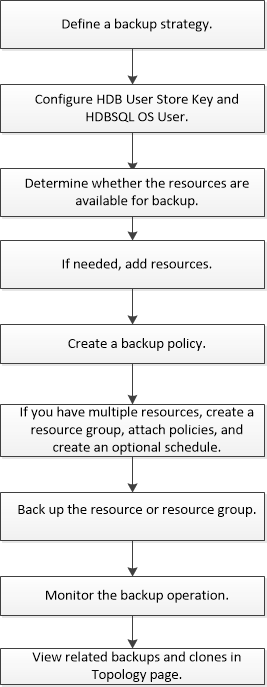

= Back up SAP HANA resources
:icons: font
:imagesdir: ../media/

[.lead]
You can either create a backup of a resource (database) or resource group. The backup workflow includes planning, identifying the databases for backup, managing backup policies, creating resource groups and attaching policies, creating backups, and monitoring the operations.

The following workflow shows the sequence in which you must perform the backup operation:

You can also use PowerShell cmdlets manually or in scripts to perform backup, restore, and clone operations. The SnapCenter cmdlet help and the cmdlet reference information contain more information about PowerShell cmdlets.

*For more information*

link:task_configure_hdb_user_store_key_and_hdbsql_os_user_for_the_sap_hana_database.html[Configure HDB User Store Key and HDBSQL OS User for the SAP HANA database]

link:task_discover_the_databases_automatically.html[Discover the databases automatically]

link:task_add_resources_manually_to_the_plug_in_host.html[Add resources manually to the plug-in host]

link:task_create_backup_policies_for_sap_hana_databases.html[Create backup policies for SAP HANA databases]

link:task_create_resource_groups_and_attach_policies.html[Create resource groups and attach policies]

link:task_back_up_sap_hana_databases.html[Back up SAP HANA databases]

link:task_monitor_hana_databases_backup_operations.html[Monitoring backup operations]

link:task_view_sap_hana_database_backups_and_clones_in_the_topology_page_sap_hana.html[View SAP HANA database backups and clones in the Topology page]

link:task_back_up_databases_using_powershell_cmdlets_sap_hana.html[Back up databases using PowerShell cmdlets]
