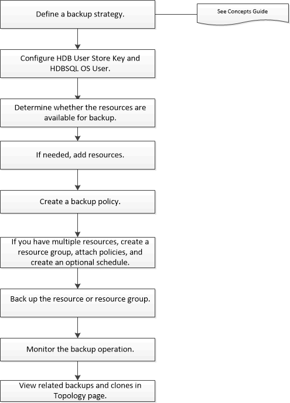

= Back up SAP HANA resources
:icons: font
:imagesdir: ../media/

[.lead]
You can either create a backup of a resource (database) or resource group. The backup workflow includes planning, identifying the databases for backup, managing backup policies, creating resource groups and attaching policies, creating backups, and monitoring the operations.

The following workflow shows the sequence in which you must perform the backup operation:

You  can also use PowerShell cmdlets manually or in scripts to perform backup, restore, and clone operations. The SnapCenter cmdlet help and the cmdlet reference information contain more information about PowerShell cmdlets.
https://docs.netapp.com/us-en/snapcenter-cmdlets/index.html[SnapCenter Software Cmdlet Reference Guide^].
