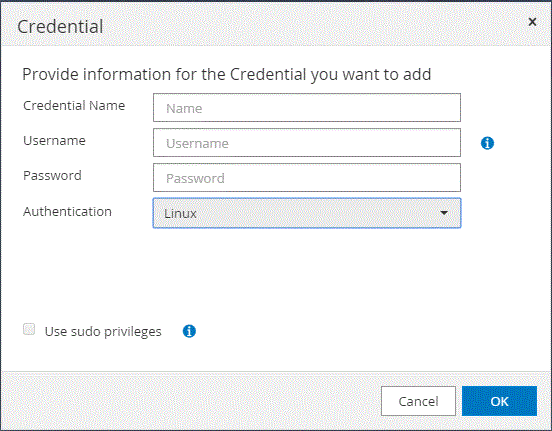

= Set up credentials for the SnapCenter Plug-in for SAP HANA Database
:icons: font
:imagesdir: ../media/

[.lead]
SnapCenter uses credentials to authenticate users for SnapCenter operations. You should create credentials for installing SnapCenter plug-ins and additional credentials for performing data protection operations on databases or Windows file systems.

.About this task

* Linux hosts
+
You must set up credentials for installing plug-ins on Linux hosts.
+
You must set up the credentials for the root user or for a non-root user who has sudo privileges to install and start the plug-in process.
+
|===
*Best Practice:* Although you are allowed to create credentials for Linux after deploying hosts and installing plug-ins, the best practice is to create credentials after you add SVMs, before you deploy hosts and install plug-ins.
|===

* Windows hosts
+
You must set up Windows credentials before installing plug-ins.
+
You must set up the credentials with administrator privileges, including administrator rights on the remote host.

If you set up credentials for individual resource groups and the username does not have full admin privileges, you must assign at least the resource group and backup privileges to the username.

.Steps

. In the left navigation pane, click *Settings*.
. In the Settings page, click *Credential*.
. Click *New*.
+

. In the Credential page, specify the information required for configuring credentials:
+
|===
| For this field...| Do this...

a|
Credential name
a|
Enter a name for the credentials.
a|
User name
a|
Enter the user name and password that are to be used for authentication.

 ** Domain administrator or any member of the administrator group
+
Specify the domain administrator or any member of the administrator group on the system on which you are installing the SnapCenter plug-in. Valid formats for the Username field are:

  *** _NetBIOS\UserName_
  *** _Domain FQDN\UserName_

 ** Local administrator (for workgroups only)
+
For systems that belong to a workgroup, specify the built-in local administrator on the system on which you are installing the SnapCenter plug-in. You can specify a local user account that belongs to the local administrators group if the user account has elevated privileges or the User Access control feature is disabled on the host system. The valid format for the Username field is: _UserName_
+
Do not use double quotes (") or backtick (`) in the passwords. You should not use the less than (<) and exclamation (!) symbols together in passwords. For example, lessthan<!10, lessthan10<!, backtick`12.
a|
Password
a|
Enter the password used for authentication.
a|
Authentication Mode
a|
Select the authentication mode that you want to use.
a|
Use sudo privileges
a|
Select the *Use sudo privileges* check box if you are creating credentials for a non-root user.

NOTE: Applicable to Linux users only.
|===

. Click *OK*.

After you finish setting up the credentials, you might want to assign credential maintenance to a user or group of users in the User and Access page.
