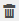

= View SAP HANA database backups and clones in the Topology page
:icons: font
:imagesdir: ../media/

[.lead]
When you are preparing to back up or clone a resource, you might find it helpful to view a graphical representation of all backups and clones on the primary and secondary storage.

.About this task

You can review the following icons in the Manage Copies view to determine whether the backups and clones are available on the primary or secondary storage (Mirror copies or Vault copies).

* image:../media/topology_primary_storage.gif[primary storage icon] displays the number of backups and clones that are available on the primary storage.
* image:../media/topology_mirror_secondary_storage.gif[secondary storage Mirror icon] displays the number of backups and clones that are mirrored on the secondary storage using SnapMirror technology.
* image:../media/topology_vault_secondary_storage.gif[secondary vault icon] displays the number of backups and clones that are replicated on the secondary storage using SnapVault technology.
+
NOTE: The number of backups displayed includes the backups deleted from the secondary storage. For example, if you created 6 backups using a policy to retain only 4 backups, the number of backups displayed is 6.

NOTE: Clones of a backup of a version-flexible mirror on a mirror-vault type volume are displayed in the topology view, but the mirror backup count in the topology view does not include the version-flexible backup.

NOTE: For SAP HANA system replication primary resources, the restore and delete operations are supported and for secondary resources, the clone operation is supported.

In the Topology page, you can see all of the backups and clones that are available for the selected resource or resource group. You can view the details of those backups and clones, and then select them to perform data protection operations.

.Steps

. In the left navigation pane, click *Resources*, and then select the appropriate plug-in from the list.
. In the Resources page, either select the resource or resource group from the *View* drop-down list.
. Select the resource either from the resource details view or from the resource group details view.
+
If the resource is protected, the topology page of the selected resource is displayed.

. Review the *Summary card* to see a summary of the number of backups and clones available on the primary and secondary storage.
+
The *Summary Card* section displays the total number of File-Based backups, Snapshot copy-based backups, and clones.
+
Clicking the *Refresh* button starts a query of the storage to display an accurate count.
+
If SnapLock enabled backup is taken, then clicking the *Refresh* button refreshes the primary and secondary SnapLock expiry time retrieved from ONTAP. A weekly schedule also refreshes the primary and secondary SnapLock expiry time retrieved from ONTAP.
+
When the application resource is spread across multiple volumes, the SnapLock expiry time for the backup will be the longest SnapLock expiry time that is set for a Snapshot in a volume. The longest SnapLock expiry time is retrieved from ONTAP.
+
After on demand backup, by clicking the *Refresh* button refreshes the details of backup or clone.

. In the Manage Copies view, click *Backups* or *Clones* from the primary or secondary storage to see details of a backup or clone.
+
The details of the backups and clones are displayed in a table format.

. Select the backup from the table, and then click the data protection icons to perform restore, clone, and delete operations. 
+
NOTE: You cannot rename or delete backups that are on the secondary storage.

. If you want to delete a clone, select the clone from the table, and then click .
. If you want to split a clone, select the clone from the table, and then click image:../media/split_cone.gif[Clone split icon].
