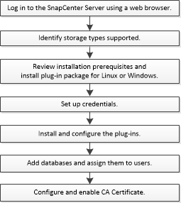

= Installation workflow of SnapCenter Plug-in for MySQL 
:icons: font
:imagesdir: ../media/

[.lead]
You should install and set up the SnapCenter Plug-in for MySQL if you want to protect MySQL databases.

