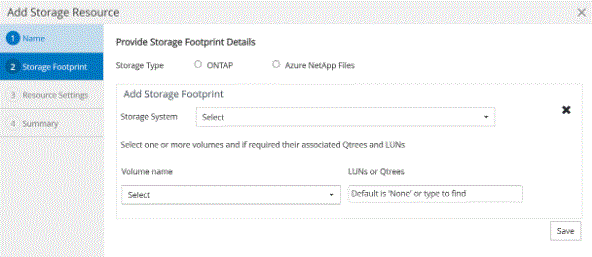

= Add resources to NetApp supported plug-ins
:icons: font
:imagesdir: ../media/

[.lead]
You must add the resources that you want to back up or clone. Depending on your environment, resources might be either database instances or collections that you want to back up or clone.

.Before you begin

* You must have completed tasks such as installing the SnapCenter Server, adding hosts, creating storage system connections, and adding credentials.
* You must have uploaded the plug-ins to SnapCenter Server.

.Steps

. In the left navigation pane, select *Resources*, and then select the appropriate plug-in from the list.
. In the Resources page, select *Add Resource*.
. In the Provide Resource Details page, perform the following actions:
+
|===
| For this field...| Do this...

a|
Name
a|
Enter the name of the resource.
a|
Host name
a|
Select the host.
a|
Type
a|
Select the type. Type is user defined as per the plug-in description file. For example, database and instance.

In case the type selected has a parent, enter the details of the parent. For example, if the type is Database and the parent is Instance, enter the details of the Instance.
a|
Credential name
a|
Select Credential or create a new credential.
a|
Mount Paths
a|
Enter the mount paths where the resource is mounted.    This is applicable only for a Windows host.
|===
. In the Provide Storage Footprint page, select a storage system and choose one or more volumes, LUNs, and qtrees, and then select *Save*.
+
Optional: Select the image:../media/add_policy_from_resourcegroup.gif[Plus icon] icon to add more volumes, LUNs, and qtrees from other storage systems.
+
NOTE: NetApp supported plug-ins does not support automatic discovery of the resources. The storage details of physical and virtual environments are also not discovered automatically. You must provide the storage information for physical and virtual environments while creating the resources.
+

. In the Resource Settings page, provide custom key-value pairs for the resource.
+
NOTE: Ensure that the custom keys name is in uppercase.
+
image::../media/resource_settings.gif[resource settings]
+
For the respective plug-in parameters, refer 
link:add_resources_to_netapp_supported_plugins.html#parameters-to-configure-the-resource[Parameters to configure the resource]

. Review the summary, and then select *Finish*.

.Result

The resources are displayed along with information such as type, host or cluster name, associated resource groups and policies, and overall status.

IMPORTANT: You must refresh the resources if the databases are renamed outside of SnapCenter.
//Included the above statement in 4.6 for BURT 1446035

.After you finish

If you want to provide access to the assets to other users, the SnapCenter administrator must assign assets to those users. This enables users to perform the actions for which they have permissions on the assets that are assigned to them.

After adding the resources, you can modify the resource details. If a NetApp supported plug-ins resource has backups associated with it, the following fields cannot be modified: resource name, resource type, and host name.

== Parameters to configure the resource 

If you are adding the plug-ins manually, you can use the following parameters to configure the resource in the Resource Settings page.

=== Plug-in for MongoDB

Resource Settings:

* MONGODB_APP_SERVER=(for resource type as sharded cluster) or MONGODB_REPLICASET_SERVER=(for resource type as replicaset)
* OPLOG_PATH=(Optional parameter in case it is provided from MongoDB.propertiesfile)
* MONGODB_AUTHENTICATION_TYPE= (PLAIN for LDAP Authentication and None for others)

You must provide the following parameters needs to be provided n MongoDB.properties file:

* DISABLE_STARTING_STOPPING_SERVICES=
** N if the start/stop services are performed by the plug-in.
** Y if start/**stop services are performed by the user.
** Optional parameter as default value is set to N.
* OPLOG_PATH_= (Optional parameter in case it is already provided as custom key-value pair in SnapCenter).

=== Plug-in for MaxDB

Resource Settings:

* XUSER_ENABLE (Y|N) enables or disables the use of an xuser for MaxDB so that a password is not required for the database user.
* HANDLE_LOGWRITER (Y|N) executes suspend logwriter (N) or resume logwriter (Y) operations.
* DBMCLICMD (path_to_dbmcli_cmd) specifies the path to the MaxDB dbmcli command. If not set, dbmcli on the search path is used.

NOTE: For Windows environment, the path must be within double-quotes ("...").

* SQLCLICMD (path_to_sqlcli_cmd) specifies the path to the MaxDB sqlcli command. If the path is not set, sqlcli is used on the search path.
* MAXDB_UPDATE_HIST_LOG (Y|N) instructs the MaxDB backup program whether it should update the MaxDB history log.
* MAXDB_CHECK_SNAPSHOT_DIR : Example, SID1:directory[,directory...]; [SID2:directoary[,directory...] checks that a Snap Creator Snapshot copy operation is successful and ensures that the snapshot is created. 
+
This applies to NFS only. The directory must point to the location that contains the .snapshot directory. Multiple directories can be included in a comma-separated list.
+
In MaxDB 7.8 and later versions, the database backup request is marked Failed in the backup history.
* MAXDB_BACKUP_TEMPLATES: Specifies a backup template for each database. 
+
The template must exist and be an external type of backup template. To enable snapshot integration for MaxDB 7.8 and later, you must have MaxDB background server functionality and already configured MaxDB backup template of the EXTERNAL type.
* MAXDB_BG_SERVER_PREFIX: Specifies the prefix for the background server name. 
+
If the MAXDB_BACKUP_TEMPLATES parameter is set, you must also set the MAXDB_BG_SERVER_PREFIX parameter. If you do not set the prefix, the default
value na_bg_ is used.

=== Plug-in for SAP ASE

Resource Settings:

* SYBASE_SERVER (data_server_name) specifies the Sybase data server name (-S option on isql command). For example, p_test.
* SYBASE_DATABASES_EXCLUDE (db_name) allows databases to be excluded if the "ALL" construct is used. 
+
You can specify multiple databases by using a semicolon-separated list. For example: pubs2;test_db1.
* SYBASE_USER: user_name specifies the operating system user who can run the isql command. 
+
Required for UNIX. This parameter is required if the user running the Snap Creator Agent start and stop commands (usually the root user) and the user running the isql command are different.
* SYBASE_TRAN_DUMP db_name:directory_path enables you to perform a Sybase transaction dump after creating a snapshot. For example, pubs2:/sybasedumps/ pubs2
+
You must specify each database requiring a transaction dump.
* SYBASE_TRAN_DUMP_COMPRESS (Y|N ) enables or disables native Sybase transaction dump compression.
* SYBASE_ISQL_CMD (For example, /opt/sybase/OCS-15_0/bin/isql) defines the path to the isql command.
* SYBASE_EXCLUDE_TEMPDB (Y|N) allows you to auto exclude user created temporary databases.

=== Plug-in for Oracle applications (ORASCPM)

Resource Settings:

* SQLPLUS_CMD specifies the path to SQLplus.
* ORACLE_DATABASES lists the Oracle databases to be backed up and corresponding user (database:user).
* CNTL_FILE_BACKUP_DIR specifies the directory for control file back up.
* ORA_TEMP specifies the directory for temporary files.
* ORACLE_HOME specifies the directory where the Oracle software is installed.
* ARCHIVE_LOG_ONLY specifies whether to back up the archive logs or not.
* ORACLE_BACKUPMODE specifies whether to perform online or offline backup.
* ORACLE_EXPORT_PARAMETERS specifies whether you can export environment variables while running _bin/su_. The value for ORACLE_EXPORT_PARAMETERS should be set to *y*.

