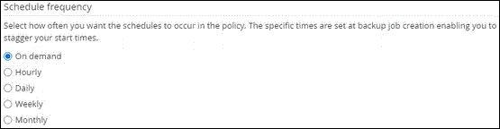

= Create backup policies for PostgreSQL
:icons: font
:imagesdir: ../media/

[.lead]
Before you use SnapCenter to back up PostgreSQL resources, you must create a backup policy for the resource or resource group that you want to back up. A backup policy is a set of rules that governs how you manage, schedule, and retain backups.

.Before you begin

* You must have defined your backup strategy.
+
For details, see the information about defining a data protection strategy for PostgreSQL clusters.
* You must have prepared for data protection by completing tasks such as installing SnapCenter, adding hosts, setting up storage system connections, and adding resources.
* The SnapCenter administrator must have assigned the SVMs for both the source and destination volumes to you if you are replicating snapshots to a mirror or vault.
+
Additionally, you can specify replication, script, and application settings in the policy. These options saves time when you want to reuse the policy for another resource group.

.About this task

* SnapLock 

** If 'Retain the backup copies for a specific number of days' option is selected, then the SnapLock retention period must be lesser than or equal to the mentioned retention days.

** Specifying a snapshot locking period prevents deletion of the snapshots until the retention period expires. This could lead to retaining a larger number of snapshots than the count specified in the policy.

** For ONTAP 9.12.1 and below version, the clones created from the SnapLock Vault snapshots as part of restore will inherit the SnapLock Vault expiry time. Storage admin should manually cleanup the clones post the SnapLock expiry time.

NOTE: Primary SnapLock settings are managed in SnapCenter backup policy and the secondary SnapLock settings are managed by ONTAP.

.Steps

. In the left navigation pane, click *Settings*.
. In the Settings page, click *Policies*.
. Click *New*.
. In the Name page, enter the policy name and description.
. In the Policy type page, perform the following:
.. Select storage type.
.. In the *Custom backup settings* section, provide any specific backup settings that have to be passed to the plug-in in key-value format.
+
You can provide multiple key-values to be passed to the plug-in.
. In the Snapshot page, specify the schedule type by selecting *On demand*, *Hourly*, *Daily*, *Weekly*, or *Monthly*.
+
NOTE: You can specify the schedule (start date, end date, and frequency) for the backup operation while creating a resource group. This enables you to create resource groups that share the same policy and backup frequency, but also enables you to assign different backup schedules to each policy.
+

+
NOTE: If you have scheduled for 2:00 a.m., the schedule will not be triggered during daylight saving time (DST).
. In the Snapshot settings section, specify the number of snapshots that you want to keep.
 
. In the Retention page, specify the retention settings for the backup type and the schedule type selected in the Backup Type page:
+
|===
| If you want to...| Then...

a|
Keep a certain number of snapshots
a|
Select *Copies to keep*, and then specify the number of snapshots that you want to keep.

If the number of snapshots exceeds the specified number, the snapshots are deleted with the oldest copies deleted first.
|===
+
IMPORTANT: For Snapshot copy-based backups, you must set the retention count to 2 or higher if you plan to enable SnapVault replication. If you set the retention count to 1, the retention operation might fail because the first snapshot is the reference snapshot for the SnapVault relationship until a newer snapshot is replicated to the target.

. Review the summary, and then click *Finish*.
