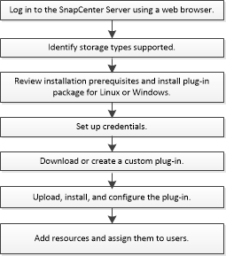

= Installation workflow of SnapCenter custom plug-ins
:icons: font
:imagesdir: ../media/

[.lead]
You should install and set up SnapCenter custom plug-ins if you want to protect custom plug-in resources.

link:develop_a_plug_in_for_your_application.html[Develop a plug-in for your application]
