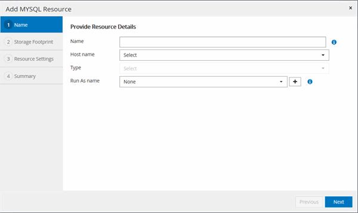
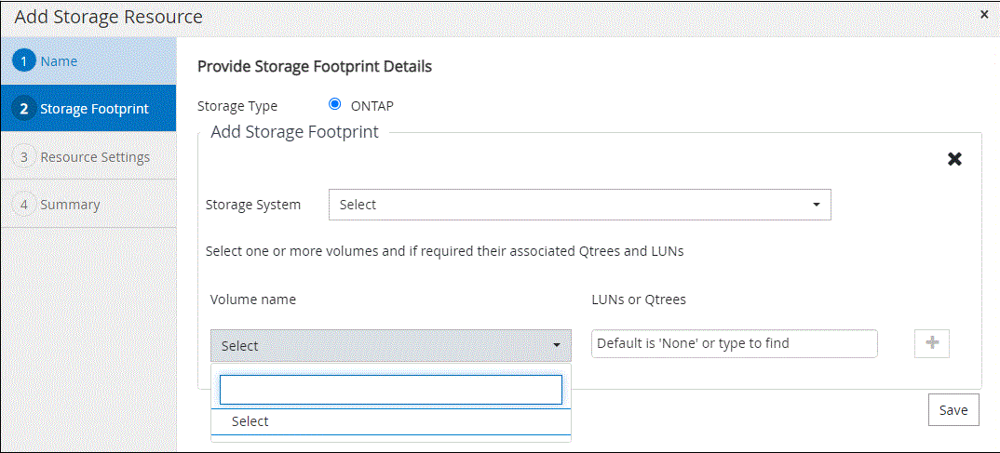
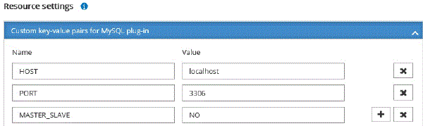

= Add resources to SnapCenter Custom Plug-ins
:icons: font
:imagesdir: ../media/

[.lead]
You must add the resources that you want to back up or clone. Depending on your environment, resources might be either database instances or collections that you want to back up or clone.

*What you will need*

* You must have completed tasks such as installing the SnapCenter Server, adding hosts, creating storage system connections, and adding credentials.
* You must have created a custom plug-in.
+
link:concept_develop_a_plug_in_for_your_application.html[Develop a plug-in for your application]

* You must have uploaded the plug-ins to SnapCenter Server.

*About this task*

You can also add resources for MySQL and DB2 applications. These plug-ins can be downloaded from the https://automationstore.netapp.com/home.shtml[NetApp Storage Automation Store].

*Steps*

. In the left navigation pane, click *Resources*, and then select the appropriate plug-in from the list.
. In the *Resources* page, click *Add Resource*.
. In the *Provide Resource Details* page, perform the following actions:
+
|===
| For this field...| Do this...

a|
Name
a|
Enter the name of the resource.
a|
Host name
a|
Select the host.
a|
Type
a|
Select the type. Type is user defined as per the plug-in description file. For example, database and instance.

In case the type selected has a parent, enter the details of the parent. For example, if the type is Database and the parent is Instance, enter the details of the Instance.
a|
Credential name
a|
(Optional) Select Credential or create a new credential.
a|
Mount Points
a|
Enter the mount paths where the resource is mounted.    This is applicable only for a Windows host.
|===

. In the *Provide Storage Footprint* page, select a storage system and choose one or more volumes, LUNs, and qtrees, and then click *Save*.
+
Optional: Click the image:../media/add_policy_from_resourcegroup.gif[] icon to add more volumes, LUNs, and qtrees from other storage systems.
+
NOTE: SnapCenter Custom Plug-ins does not support automatic discovery of the resources and the storage details for physical and virtual environments. You must provide the storage information for physical and virtual environments while creating the resources.
+

. In the *Resource Settings* page, provide custom key-value pairs for the resource.
+
Use the custom key-value pairs if you want to pass resource-specific information. For example, when you are using the MySQL plug-in, you must specify a HOST as HOST=hostname, PORT =port-no used for MySQL and master-slave configuration as MASTER_SLAVE = "`YES`" or "`NO`" (name is MASTER_SLAVE and value is "`YES`" or "`NO`").
+
NOTE: Ensure that the words HOST and PORT are in uppercase.
+

. Review the summary, and then click *Finish*.

*Result*

The resources are displayed along with information such as type, host or cluster name, associated resource groups and policies, and overall status.

*After you finish*

If you want to provide access to the assets to other users, the SnapCenter administrator must assign assets to those users. This enables users to perform the actions for which they have permissions on the assets that are assigned to them.

After adding the resources, you can modify the resource details. If a custom plug-in resource has backups associated with it, the following fields cannot be modified: resource name, resource type, and host name.
