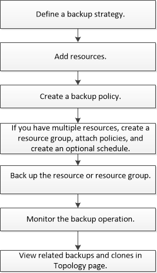

= Back up custom plug-in resources
:icons: font
:imagesdir: ../media/

[.lead]
The backup workflow includes planning, identifying the resources for backup, managing backup policies, creating resource groups and attaching policies, creating backups, and monitoring the operations.

The following workflow shows the sequence in which you must perform the backup operation:

You can also use PowerShell cmdlets manually or in scripts to perform backup, restore, and clone operations. For detailed information about PowerShell cmdlets, use the SnapCenter cmdlet help or see the https://library.netapp.com/ecm/ecm_download_file/ECMLP2877143[SnapCenter Software Cmdlet Reference Guide]
