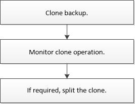

= Clone custom plug-in resource backups
:icons: font
:imagesdir: ../media/

[.lead]
The clone workflow includes performing the clone operation and monitoring the operation.

.About this task

You might clone resource backups for the following reasons:

* To test functionality that has to be implemented using the current resource structure and content during application development cycles
* For data extraction and manipulation tools when populating data warehouses
* To recover data that was mistakenly deleted or changed

The following workflow shows the sequence in which you must perform the clone operation:

You can also use PowerShell cmdlets manually or in scripts to perform backup, restore, and clone operations. For detailed information about PowerShell cmdlets, use the SnapCenter cmdlet help or see the https://library.netapp.com/ecm/ecm_download_file/ECMLP2886205[SnapCenter Software Cmdlet Reference Guide^].
