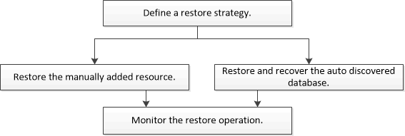

= Restore custom plug-in resources
:icons: font
:imagesdir: ../media/

[.lead]
The restore and recovery workflow includes planning, performing the restore operations, and monitoring the operations.

The following workflow shows the sequence in which you must perform the restore operation:

You can also use PowerShell cmdlets manually or in scripts to perform backup, restore, and clone operations. The SnapCenter cmdlet help and the cmdlet reference information contain detailed information about PowerShell cmdlets.

*Source*

link:[Data protection workflow for SnapCenter Custom Plug-ins resources]

*Target*

https://library.netapp.com/ecm/ecm_download_file/ECMLP2874310[SnapCenter Software 4.4 Cmdlet Reference Guide]
