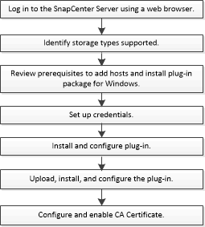

= SnapCenter Plug-in for Microsoft Exchange Server installation workflow
:icons: font
:imagesdir: ../media/

[.lead]
You should install and set up SnapCenter Plug-in for Microsoft Exchange Server if you want to protect Exchange databases.

