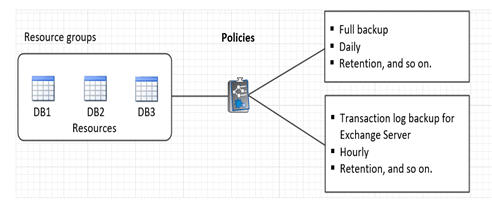

= Prepare for data protection
:icons: font
:imagesdir: ../media/

include::_include/reuse_concept_prepare_for_data_protection.adoc[]

== Prerequisites for using the SnapCenter Plug-in for Microsoft Exchange Server

Before you use the Plug-in for Exchange, the SnapCenter administrator must install and configure the SnapCenter Server and perform the prerequisite tasks.

* Install and configure SnapCenter Server.
* Log in to SnapCenter.
* Configure the SnapCenter environment by adding or assigning storage system connections and creating a credential.
+
NOTE: SnapCenter does not support multiple SVMs with the same name on different clusters. Each SVM supported by SnapCenter must have a unique name.

* Add hosts, install the SnapCenter Plug-in for Microsoft Windows and the SnapCenter Plug-in for Microsoft Exchange Server, and discover (refresh) the resources.
* Perform host-side storage provisioning using the SnapCenter Plug-in for Microsoft Windows.
* If you are using SnapCenter Server to protect Exchange databases that reside on VMware RDM LUNs, you must deploy the SnapCenter Plug-in for VMware vSphere and register the plug-in with SnapCenter. The SnapCenter Plug-in for VMware vSphere documentation has more information.
+
NOTE: VMDKs are not supported.

* Move an existing Microsoft Exchange Server database from a local disk to supported storage using Microsoft Exchange tools.
* Set up SnapMirror and SnapVault relationships, if you want backup replication.

For SnapCenter 4.1.1 users, the SnapCenter Plug-in for VMware vSphere 4.1.1 documentation has information on protecting virtualized databases and file systems. For SnapCenter 4.2.x users, the NetApp Data Broker 1.0 and 1.0.1, documentation has information on protecting virtualized databases and file systems using the SnapCenter Plug-in for VMware vSphere that is provided by the Linux-based NetApp Data Broker virtual appliance (Open Virtual Appliance format). For SnapCenter 4.3.x users, the SnapCenter Plug-in for VMware vSphere 4.3 documentation has information on protecting virtualized databases and file systems using the Linux-based SnapCenter Plug-in for VMware vSphere virtual appliance (Open Virtual Appliance format).

https://docs.netapp.com/us-en/sc-plugin-vmware-vsphere/[SnapCenter Plug-in for VMware vSphere documentation^]

== How resources, resource groups, and policies are used for protecting Exchange Server

Before you use SnapCenter, it is helpful to understand basic concepts related to the backup and restore operations you want to perform. You interact with resources, resource groups, and policies for different operations.

* Resources are typically mailbox databases or Microsoft Exchange Database Availability Group (DAG) that you back up with SnapCenter.
* A SnapCenter resource group, is a collection of resources on a host or Exchange DAG, and the resource group can include either a whole DAG or individual databases.
+
When you perform an operation on a resource group, you perform that operation on the resources defined in the resource group according to the schedule you specify for the resource group.
+
You can back up on demand a single resource or a resource group. You also can perform scheduled backups for single resources and resource groups.
+
The resource groups were formerly known as datasets.

* The policies specify the backup frequency, copy retention, scripts, and other characteristics of data protection operations.
+
When you create a resource group, you select one or more policies for that group. You can also select one or more policies when you perform a backup on demand for a single resource.

Think of a resource group as defining _what_ you want to protect and when you want to protect it in terms of day and time. Think of a policy as defining _how_ you want to protect it. If you are backing up all databases of a host, for example, you might create a resource group that includes all the databases in the host. You could then attach two policies to the resource group: a daily policy and an hourly policy. When you create the resource group and attach the policies, you might configure the resource group to perform a full backup daily and another schedule that performs log backups hourly. The following image illustrates the relationship between resources, resource groups, and policies for databases:

