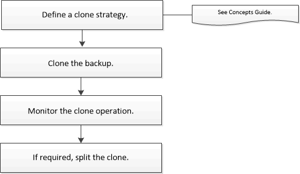

= Clone workflow
:icons: font
:imagesdir: ../media/

[.lead]
The clone workflow includes planning, performing the clone operation, and monitoring the operation.

You might clone databases for the following reasons:

* To test functionality that has to be implemented using the current database structure and content during application development cycles.
* To populate data warehouses using data extraction and manipulation tools.
* To recover data that was mistakenly deleted or changed.

The following workflow shows the sequence in which you must perform the clone operation:

