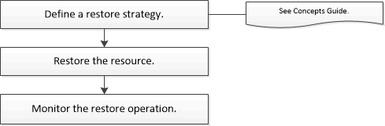

= Restore workflow
:icons: font
:imagesdir: ../media/

[.lead]
The restore workflow includes planning, performing the restore operations, and monitoring the operations.

The following workflow shows the sequence in which you must perform the restore operation:

