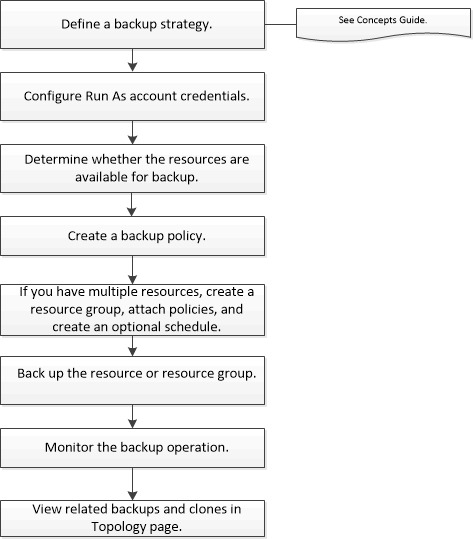

= Back up Oracle databases
:icons: font
:imagesdir: ../media/

[.lead]
You can either create a backup of a resource (database) or resource group. The backup workflow includes planning, identifying the resources for backup, creating backup policies, creating resource groups and attaching policies, creating backups, and monitoring the operations.

The following workflow shows the sequence in which you must perform the backup operation:

While creating a backup for Oracle databases, an operational lock file (.sm_lock_dbsid) is created on the Oracle database host in the $ORACLE_HOME/dbs directory to avoid multiple operations being executed on the database. After the database has been backed up, the operational lock file is automatically removed.

However, if the previous backup was completed with a warning, the operational lock file might not get deleted, and the next backup operation gets into the wait queue. It might eventually get canceled if the sm_lock_dbsid file is not deleted. In such scenario, you must manually delete the operational lock file by running rm -rf .sm_lock_dbsid from $ORACLE_HOME/dbs.

. From the command prompt, navigate to $ORACLE_HOME/dbs.
. Delete the operational lock:``rm -rf .sm_lock_dbsid.``

You can also use commands manually or in scripts to perform backup operations. For detailed information about the commands, use the SnapCenter command help or see the command reference information.

*Related information*

xref:task_back_up_oracle_databases_using_unix_commands.adoc[Back up Oracle databases using UNIX commands]

http://docs.netapp.com/ocsc-44/topic/com.netapp.doc.ocsc-con/home.html[Concepts]

https://library.netapp.com/ecm/ecm_download_file/ECMLP2874313[SnapCenter Software 4.4 Command Reference Guide]
