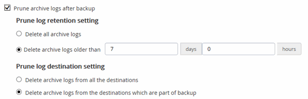

= Create backup policies for Oracle databases
:icons: font
:imagesdir: ../media/

[.lead]
Before you use SnapCenter to back up Oracle database resources, you must create a backup policy for the resource or the resource group that you want to back up. A backup policy is a set of rules that governs how you manage, schedule, and retain backups. You can also specify the replication, script, and backup type settings. Creating a policy saves time when you want to reuse the policy on another resource or resource group.

*Before you begin*

* You must have defined your backup strategy.
* You must have prepared for data protection by completing tasks such as installing SnapCenter, adding hosts, discovering databases, and creating storage system connections.
* If you are replicating Snapshots to a mirror or vault secondary storage, the SnapCenter administrator must have assigned the SVMs to you for both the source and destination volumes.
* If you have installed the plug-in as a non-root user, you should manually assign the execute permissions to the prescript and postscript directories.
* For SnapMirror Business Continuity (SM-BC) prerequisites and limitations refer https://docs.netapp.com/us-en/ontap/smbc/considerations-limits.html#volumes[Object limits for SnapMirror Business Continuity].

.About this task

* SnapLock
** If 'Retain the backup copies for a specific number of days' option is selected, then the SnapLock retention period must be lesser than or equal to the mentioned retention days.
+
Specifying a Snapshot locking period prevents deletion of the Snapshots until the retention period expires. This could lead to retaining a larger number of Snapshots than the count specified in the policy.
+
For ONTAP 9.12.1 and below version, the clones created from the SnapLock Vault Snapshots  as part of restore will inherit the SnapLock Vault expiry time. Storage admin should manually cleanup the clones post the SnapLock expiry time.
+
NOTE: Primary SnapLock settings are managed in SnapCenter backup policy and the secondary
SnapLock settings are managed by ONTAP.

*Steps*

. In the left navigation pane, click *Settings*.
. In the Settings page, click *Policies*.
. Select *Oracle Database* from the drop-down list.
. Click *New*.
. In the Name page, enter the policy name and description.
. In the Backup Type page, perform the following steps:
 ** If you want to *create an online backup*, select *Online backup*.
+
You must specify whether you want to back up all the datafiles, control files, and archive log files, only datafiles and control files, or only archive log files.

 ** If you want to *create an offline backup*, select *Offline backup*, and then select one of the following options:
  *** If you want to create an offline backup when the database is in mounted state, select *Mount*.
  *** If you want to create an offline shutdown backup by changing the database to shutdown state, select *Shutdown*.
+
If you are having pluggable databases (PDBs), and want to save the state of the PDBs before creating the backup, you must select *Save state of PDBs*. This enables you to bring the PDBs to their original state after the backup is created.
 ** Specify the schedule frequency by selecting *On demand*, *Hourly*, *Daily*, *Weekly*, or *Monthly*.
+
NOTE: You can specify the schedule (start date and end date) for the backup operation while creating a resource group. This enables you to create resource groups that share the same policy and backup frequency, but enables you to assign different backup schedules to each policy.
+
NOTE: If you have scheduled for 2:00 a.m., the schedule will not be triggered during daylight saving time (DST).

 ** If you want to catalog backup using Oracle Recovery Manager (RMAN), select *Catalog backup with Oracle Recovery Manager (RMAN)*.
+
You can perform deferred cataloging for one backup at a time either using the GUI or using the SnapCenter CLI command Catalog-SmBackupWithOracleRMAN.
+
NOTE: If you want to catalog backups of a RAC database, ensure that no other job is running for that database. If another job is running, the cataloging operation fails instead of getting queued.

 ** If you want to prune archive logs after backup, select *Prune archive logs after backup*.
+
NOTE: Pruning of archive logs from the archive log destination that is unconfigured in the database, will be skipped.
+
IMPORTANT: If you are using Oracle Standard Edition, you can use LOG_ARCHIVE_DEST and LOG_ARCHIVE_DUPLEX_DEST parameters while performing archive log backup.

 ** You can delete archive logs only if you have selected the archive log files as part of your backup.
+
NOTE: You must ensure that all the nodes in an RAC environment can access all the archive log locations for the delete operation to be successful.
+

|===
| If you want to... | Then...

a|
Delete all archive logs
a|
Select *Delete all archive logs*.
a|
Delete archive logs that are older
a|
Select *Delete archive logs older than*, and then specify the age of the archive logs that are to be deleted in days and hours.
a|
Delete archive logs from all destinations
a|
Select *Delete archive logs from all the destinations*.
a|
Delete the archive logs from the log destinations that are part of the backup
a|
Select *Delete archive logs from the destinations which are part of backup*.
|===

. In the Retention page, specify the retention settings for the backup type and the schedule type selected in the Backup Type page:
+
|===
| If you want to...| Then...
a|
Keep a certain number of Snapshots 
a|
Select *Total Snapshot copies to keep*, and then specify the number of Snapshots that you want to keep.

If the number of Snapshots exceeds the specified number, the Snapshots are deleted with the oldest copies deleted first.

NOTE: The maximum retention value is 1018 for resources on ONTAP 9.4 or later, and 254 for resources on ONTAP 9.3 or earlier. Backups will fail if retention is set to a value higher than what the underlying ONTAP version supports.

IMPORTANT: You must set the retention count to 2 or higher if you plan to enable SnapVault replication. If you set the retention count to 1, the retention operation might fail because the first Snapshot is the reference Snapshot for the SnapVault relationship until a newer Snapshot is replicated to the target.

a|
Keep the Snapshots for a certain number of days
a|
Select *Keep Snapshot copies for*, and then specify the number of days for which you want to keep the Snapshots before deleting them.
a|
Snapshot locking period
a|
Select Snapshot copy locking period, and select days, months, or years.

SnapLock retention period should be less than 100 years.
|===
+
NOTE:  You can retain archive log backups only if you have selected the archive log files as part of your backup.

. In the Replication page, specify the replication settings:
+
|===
| For this field... | Do this...

a|
Update SnapMirror after creating a local Snapshot 
a|
Select this field to create mirror copies of the backup sets on another volume (SnapMirror replication).

This option should be enabled for SnapMirror Business Continuity (SM-BC).

During secondary replication, the SnapLock expiry time loads the primary SnapLock expiry time. 

Clicking the *Refresh* button in the Topology page refreshes the secondary and primary SnapLock expiry time that are retrieved from ONTAP.
a|
Update SnapVault after creating a local Snapshot 
a|
Select this option to perform disk-to-disk backup replication (SnapVault backups).

When SnapLock is configured only on the secondary from ONTAP known as SnapLock Vault, clicking the *Refresh* button in the Topology page refreshes the locking period on the secondary that is retrieved from ONTAP.

For more information on SnapLock Vault see https://docs.netapp.com/us-en/ontap/snaplock/commit-snapshot-copies-worm-concept.html[Commit Snapshot copies to WORM on a vault destination]

See link:..protect-sco/task_view_oracle_databse_backups_and_clones_in_the_topology_page.html[View Oracle database backups and clones in the Topology page].
a|
Secondary policy label
a|
Select a Snapshot label.

Depending on the Snapshot label that you select, ONTAP applies the secondary Snapshot retention policy that matches the label.

NOTE: If you have selected *Update SnapMirror after creating a local Snapshot copy*, you can optionally specify the secondary policy label. However, if you have selected *Update SnapVault after creating a local Snapshot copy*, you should specify the secondary policy label.

a|
Error retry count
a|
Enter the maximum number of replication attempts that can be allowed before the operation stops.
|===
+
NOTE: You should configure SnapMirror retention policy in ONTAP for the secondary storage to avoid reaching the maximum limit of Snapshots on the secondary storage.

. In the Script page, enter the path and the arguments of the prescript or postscript that you want to run before or after the backup operation, respectively.
+
You must store the prescripts and postscripts either in _/var/opt/snapcenter/spl/scripts_ or in any folder inside this path. By default, the _/var/opt/snapcenter/spl/scripts_ path is populated. If you have created any folders inside this path to store the scripts, you must specify those folders in the path.
+
You can also specify the script timeout value. The default value is 60 seconds.
+
SnapCenter allows you to use the predefined environment variables when you execute the prescript and postscript. link:../protect-sco/predefined-environment-variables-prescript-postscript-backup.html[Learn more^]

. In the Verification page, perform the following steps:
 .. Select the backup schedule for which you want to perform the verification operation.
 .. In the Verification script commands section, enter the path and the arguments of the prescript or postscript that you want to run before or after the verification operation, respectively.
+
You must store the prescripts and postscripts either in _/var/opt/snapcenter/spl/scripts_ or in any folder inside this path. By default, the _/var/opt/snapcenter/spl/scripts_ path is populated. If you have created any folders inside this path to store the scripts, you must specify those folders in the path.
+
You can also specify the script timeout value. The default value is 60 seconds.
. Review the summary, and then click *Finish*.
