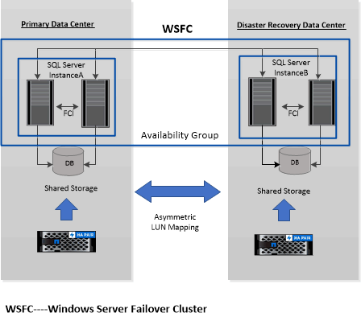

= Support for Asymmetric LUN Mapping in Windows clusters
:icons: font
:imagesdir: ../media/

[.lead]
SnapCenter Plug-in for Microsoft SQL Server supports discovery in SQL Server 2012 and later, Asymmetric LUN Mapping (ALM) configurations for high availability, and availability groups for disaster recovery. When discovering resources, SnapCenter discovers databases on local hosts and on remote hosts in ALM configurations.

An ALM configuration is a single Windows server failover cluster that contains one or more nodes in a primary data center and one or more nodes in a disaster recovery center.

Following is an example of an ALM configuration:

* Two failover cluster instances (FCI) in a multi-site datacenter
* FCI for local high availability (HA) and Availability Group (AG) for disaster recovery with a stand-alone instance at the disaster recovery site

The storage in the primary datacenter is shared between the FCI nodes present in the primary datacenter. The storage in the disaster recovery datacenter is shared between the FCI nodes present in the disaster recovery datacenter.

The storage on the primary datacenter is not visible to the nodes on the disaster recovery datacenter, and vice versa.

ALM architecture combines two shared storage solution used by FCI, with non-shared or dedicated storage solution used by SQL AG. The AG solution uses identical drive letters for shared disk resources across data centers. This arrangement of storage, where a cluster disk is shared between a subset of nodes within a WSFC, is referred to as ALM.
