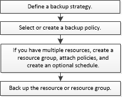

= Backup workflow
:icons: font
:imagesdir: ../media/

[.lead]
When you install the SnapCenter Plug-in for Microsoft SQL Server in your environment, you can use SnapCenter to back up the SQL Server resources.

You can schedule multiple backups to run across servers simultaneously.

Backup and restore operations cannot be performed simultaneously on the same resource.

The following workflow shows the sequence in which you must perform the backup operations:

NOTE: The Backup Now, Restore, Manage Backups, and Clone options on the Resources page are disabled if you select a non-NetApp LUN, a database that is corrupted, or a database that is being restored.

You can also use PowerShell cmdlets manually or in scripts to perform backup, restore, recovery, verify, and clone operations. For detailed information about PowerShell cmdlets, use the SnapCenter cmdlet help or see the https://library.netapp.com/ecm/ecm_download_file/ECMLP2883300[SnapCenter Software Cmdlet Reference Guide]

== How SnapCenter backs up databases

SnapCenter uses Snapshot copy technology to back up the SQL Server databases that reside on LUNs or VMDKs. SnapCenter creates the backup by creating Snapshot copies of the databases.

When you select a database for a full database backup from the Resources page, SnapCenter automatically selects all the other databases that reside on the same storage volume. If the LUN or VMDK stores only a single database, you can clear or reselect the database individually. If the LUN or VMDK houses multiple databases, you must clear or reselect the databases as a group.

All the databases that reside on a single volume are backed up concurrently using Snapshot copies. If the maximum number of concurrent backup databases is 35, and if more than 35 databases reside in a storage volume, then the total number of Snapshot copies that are created equals the number of databases divided by 35.

NOTE: You can configure the maximum number of databases for each Snapshot copy in the backup policy.

When SnapCenter creates a Snapshot copy, the entire storage system volume is captured in the Snapshot copy. However, the backup is valid only for the SQL host server for which the backup was created.

If data from other SQL host servers resides on the same volume, this data cannot be restored from the Snapshot copy.

*Find more information*

link:task_back_up_resources_using_powershell_cmdlets_for_sql.html[Back up resources using PowerShell cmdlets]

link:https://kb.netapp.com/Advice_and_Troubleshooting/Data_Protection_and_Security/SnapCenter/Quiesce_or_grouping_resources_operations_fail[Quiesce or grouping resources operations fail]
