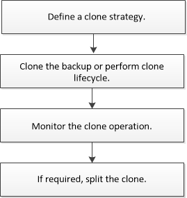

= Clone workflow
:icons: font
:imagesdir: ../media/

[.lead]
You must perform several tasks using SnapCenter Server before cloning database resources from a backup. Database cloning is the process of creating a point-in-time copy of a production database or its backup set. You can clone databases to test functionality that has to be implemented using the current database structure and content during application development cycles, to use the data extraction and manipulation tools when populating data warehouses, or to recover data that was mistakenly deleted or changed.

A database cloning operation generates reports based on the job IDs.

The following workflow shows the sequence in which you must perform the cloning operations:

You can also use PowerShell cmdlets manually or in scripts to perform backup, restore, recovery, verify, and clone operations. For detailed information about PowerShell cmdlets, use the SnapCenter cmdlet help or see the https://library.netapp.com/ecm/ecm_download_file/ECMLP2886205[SnapCenter Software Cmdlet Reference Guide]

*Find more information*

link:task_clone_from_a_sql_server_database_backup.html[Clone from a SQL Server database backup]

link:task_perform_clone_lifecycle_management.html[Perform Clone Lifecycle]

link:https://kb.netapp.com/Advice_and_Troubleshooting/Data_Protection_and_Security/SnapCenter/Clone_operation_might_fail_or_take_longer_time_to_complete_with_default_TCP_TIMEOUT_value[Clone operation might fail or take longer time to complete with default TCP_TIMEOUT value]
