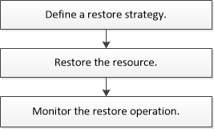

= Restore workflow
:icons: font
:imagesdir: ../media/

[.lead]
You can use SnapCenter to restore SQL Server databases by restoring the data from one or more backups to your active file system and then recovering the database. You can also restore databases that are in Availability Groups and then add the restored databases to the Availability Group. Before restoring an SQL Server database, you must perform several preparatory tasks.

The following workflow shows the sequence in which you must perform the database restoration operations:

You can also use PowerShell cmdlets manually or in scripts to perform backup, restore, recovery, verify, and clone operations. For detailed information about PowerShell cmdlets, use the SnapCenter cmdlet help or see the https://library.netapp.com/ecm/ecm_download_file/ECMLP2874310[SnapCenter Software 4.4 Cmdlet Reference Guide]

*Find more information*

link:task_restore_a_sql_server_database_from_secondary_storage.html[Restore an SQL Server database from secondary storage]

link:task_restore_and_recover_resources_using_powershell_cmdlets_for_sql.html[Restore and recover resources using PowerShell cmdlets]

link:https://kb.netapp.com/Advice_and_Troubleshooting/Data_Protection_and_Security/SnapCenter/Restore_operation_might_fail_on_Windows_2008_R2[Restore operation might fail on Windows 2008 R2]
