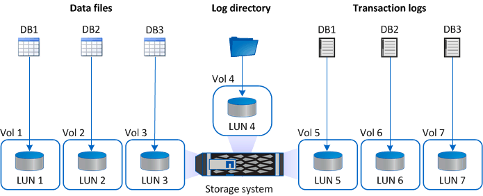
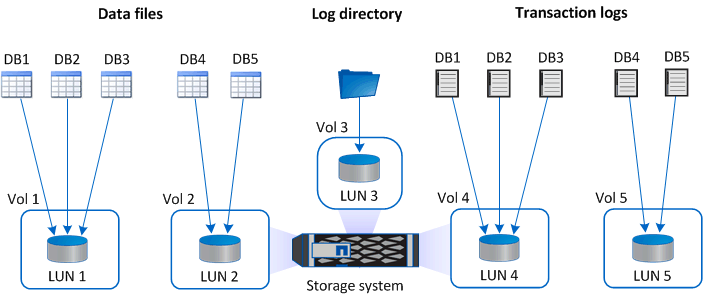
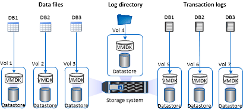
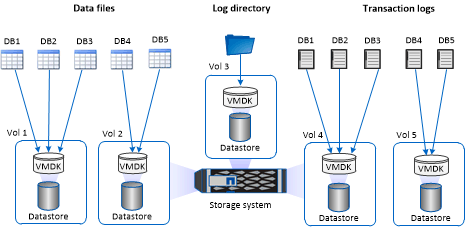

= Storage layout recommendations for SnapCenter Plug-in for Microsoft SQL Server
:icons: font
:imagesdir: ../media/

[.lead]
A well-designed storage layout allows SnapCenter Server to back up your databases to meet your recovery objectives. You should consider several factors while defining your storage layout, including the size of the database, the rate of change of the database, and the frequency with which you perform backups.

The following sections define the storage layout recommendations and restrictions for LUNs and virtual machine disks (VMDKs) with SnapCenter Plug-in for Microsoft SQL Server installed in your environment.

In this case, LUNs can include VMware RDM disks and iSCSI direct-attached LUNs that are mapped to the guest.

NOTE: VMDK and physical raw device mapping (RDM) disk mapped to a single VM guest is not supported.

== LUN and VMDK requirements

You can optionally use dedicated LUNs or VMDKs for optimum performance and management for the following databases:

* Master and model system databases
* Tempdb
* User database files (.mdf and .ndf)
* User database transaction log files (.ldf)
* Log directory

To restore large databases, the best practice is to use dedicated LUNs or VMDKs. The time taken to restore a complete LUN or VMDK is less than the time taken to restore the individual files that are stored in the LUN or VMDK.

For the log directory, you should create a separate LUN or VMDK so that there is sufficient free space in the data or log file disks.

== LUN and VMDK sample layouts

The following graphic shows how you can configure the storage layout for large databases on LUNs:

The following graphic shows how you can configure the storage layout for medium or small databases on LUNs:

The following graphic shows how you can configure the storage layout for large databases on VMDKs:

The following graphic shows how you can configure the storage layout for medium or small databases on VMDKs:

