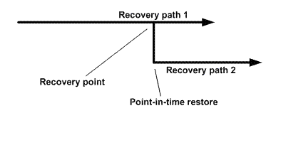

= Types of restore operations
:icons: font
:imagesdir: ../media/

[.lead]
You can use SnapCenter to perform different types of restore operations on SQL Server resources.

* Restore up-to-the-minute
* Restore to a previous point in time

You can restore up to the minute or restore to a previous point in time in the following situations:

* Restore from SnapMirror or SnapVault secondary storage
* Restore to alternate path (location)

NOTE: SnapCenter does not support volume-based SnapRestore.

== Restore up to the minute

In an up-to-the-minute restore operation (selected by default), databases are recovered up to the point of failure. SnapCenter accomplishes this by performing the following sequence:

. Backs up the last active transaction log before restoring the database.
. Restores the databases from the full database backup that you select.
. Applies all the transaction logs that were not committed to the databases (including transaction logs from the backups from the time the backup was created up to the most current time).
+
Transaction logs are moved ahead and applied to any selected databases.

An up-to-the-minute restore operation requires a contiguous set of transaction logs.

Because the SnapCenter cannot restore SQL Server database transaction logs from log-shipping backup files (log-shipping enables you to automatically send transaction log backups from a primary database on a primary server instance to one or more secondary databases on separate secondary server instances), you are not able to perform an up-to-the-minute restore operation from the transaction log backups. For this reason, you should use the SnapCenter to back up your SQL Server database transaction log files.

If you do not need to retain up-to-the-minute restore capability for all backups, you can configure your system's transaction log backup retention through the backup policies.

== Example of an up-to-the-minute restore operation

Assume that you run the SQL Server backup every day at noon, and on Wednesday at 4:00 p.m. you need to restore from a backup. For some reason, the backup from Wednesday noon failed verification, so you decide to restore from the Tuesday noon backup. After that, if the backup is restored, all the transaction logs are moved forward and applied to the restored databases, starting with those that were not committed when you created Tuesday's backup and continuing through the latest transaction log written on Wednesday at 4:00 p.m. (if the transaction logs were backed up).

== Restore to a previous point in time

In a point-in-time restore operation, databases are restored only to a specific time from the past. A point-in-time restore operation occurs in the following restore situations:

* The database is restored to a given time in a backed-up transaction log.
* The database is restored, and only a subset of backed-up transaction logs are applied to it.

NOTE: Restoring a database to a point in time results in a new recovery path.

The following image illustrates the issues when a point-in-time restore operation is performed:

In the image, recovery path 1 consists of a full backup followed by several transaction log backups. You restore the database to a point in time. New transaction log backups are created after the point-in-time restore operation, which results in recovery path 2. The new transaction log backups are created without creating a new full backup. Due to data corruption or other problems, you cannot restore the current database until a new full backup is created. Also, it is not possible to apply the transaction logs created in recovery path 2 to the full backup belonging to recovery path 1.

If you apply transaction log backups, you can also specify a particular date and time at which you want to stop the application of backed up transactions. To do this, you specify a date and time within the available range and the SnapCenter removes any transactions that were not committed prior to that point in time. You can use this method to restore databases to a point in time before a corruption occurred, or to recover from an accidental database or table deletion.

== Example of a point-in-time restore operation

Suppose you make full database backups once at midnight and a transaction log backup every hour. The database crashes at 9:45 a.m., but you still back up the transaction logs of the failed database. You can choose from among these point-in-time restore scenarios:

* Restore the full database backup made at midnight and accept the loss of the database changes made afterward. (Option: None)
* Restore the full database backup and apply all the transaction log backups until 9:45 a.m. (Option: Log until)
* Restore the full database backup and apply transaction log backups, specifying the time you want the transactions to restore from the last set of transaction log backups. (Option: By specific time)

In this case, you would calculate the date and time at which a certain error was reported. Any transactions that were not committed prior to the date and time specified are removed.
