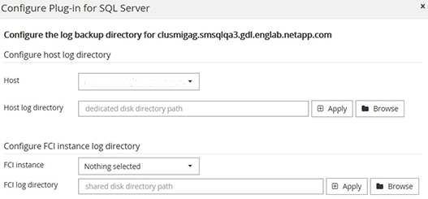

= Add hosts and install the SnapCenter Plug-ins Package for Windows
:icons: font
:imagesdir: ../media/

[.lead]
You must use the SnapCenter *Add Host* page to add hosts and install the plug-ins package. The plug-ins are automatically installed on the remote hosts.

.What you'll need

* You must be a user that is assigned to a role that has the plug-in install and uninstall permissions, such as the SnapCenter Admin role.
* When installing a plug-in on a Windows host, if you specify a credential that is not built-in, you should disable UAC on the host.
* You should ensure that the message queueing service is in running state.
* If you are using group Managed Service Account (gMSA), you should configure gMSA with administrative privileges.
+
link:task_configure_gMSA_on_windows_server_2012_or_later.html[Configure group Managed Service Account on Windows Server 2012 or later for SQL^]

.About this task

You cannot add a SnapCenter Server as a plug-in host to another SnapCenter Server.

You can add a host and install the plug-in packages either for an individual host or for a cluster. If you are installing the plug-ins on a cluster or Windows Server Failover Clustering (WSFC), the plug-ins are installed on all of the nodes of the cluster.

For information on managing hosts, see link:../admin/concept_manage_hosts.html[Manage hosts^].

.Steps

. In the left navigation pane, select *Hosts*.
. Verify that the *Managed Hosts* tab is selected at the top.
. Select *Add*.
. In the Hosts page do the following:
+
|===
| For this field...| Do this...

a|
Host Type
a|
Select Windows as the host type.    The SnapCenter Server adds the host, and then installs the Plug-in for Windows if the plug-in is not already installed on the host.

If you select the Microsoft SQL Server option on the Plug-ins page, the SnapCenter Server installs the Plug-in for SQL Server.
a|
Host name
a|
Enter the fully qualified domain name (FQDN) or the IP address of the host.    IP address is supported for untrusted domain hosts only if it resolves to the FQDN.

SnapCenter depends on the proper configuration of the DNS. Therefore, the best practice is to enter the FQDN.

You can enter the IP addresses or FQDN of one of the following:

 ** Stand-alone host
 ** WSFC
If you are adding a host by using SnapCenter and the host is part of a subdomain, you must provide the FQDN.

a|
Credentials
a|
Select the credential name that you created or create new credentials.     The credential must have administrative rights on the remote host. For details, see the information about creating credentials.

You can view details about the credentials by positioning your cursor over the credential name that you specified.

NOTE: The credentials authentication mode is determined by the host type that you specify in the Add Host wizard.
|===

. In the *Select Plug-ins to Install* section, select the plug-ins to install.
. Select *More Options*.
+
|===
| For this field...| Do this...

a|
Port
a|
Either retain the default port number or specify the port number.    The default port number is 8145. If the SnapCenter Server was installed on a custom port, that port number will be displayed as the default port.

NOTE: If you manually installed the plug-ins and specified a custom port, you must specify the same port. Otherwise, the operation fails.
a|
Installation Path
a|
The default path is C:\Program Files\NetApp\SnapCenter. You can optionally customize the path.
a|
Add all hosts in the cluster
a|
Select this check box to add all of the cluster nodes in a WSFC or a SQL Availability Group.    You should add all the cluster nodes by selecting the appropriate cluster check box in the GUI if you want to manage and identify multiple available SQL Availability Groups within a cluster.
a|
Skip preinstall checks
a|
Select this check box if you already installed the plug-ins manually and you do not want to validate whether the host meets the requirements for installing the plug-in.
a|
Use group Managed Service Account (gMSA) to run the plug-in services
a|
Select this check box if you want to use group Managed Service Account (gMSA) to run the plug-in services.

Provide the gMSA name in the following format: domainName\accountName$.

NOTE: If the host is added with gMSA and if the gMSA has login and sys admin privileges, the gMSA will be used to connect to the SQL instance.
|===

. Select *Submit*.
. For SQL Plug-in, select the host to configure the log directory.
.. Select *Configure log directory* and in the Configure host log directory page, select *Browse* and complete the following steps:
+
Only NetApp LUNs (drives) are listed for selection. SnapCenter backs up and replicates the host log directory as part of the backup operation.
+

 ... Select the drive letter or mount point on the host where the host log will be stored.
 ... Choose a subdirectory, if required.
 ... Select *Save*.

. Select *Submit*.
+
If you have not selected the *Skip prechecks* check box, the host is validated to verify whether it meets the requirements for installing the plug-in. The disk space, RAM, PowerShell version, .NET version, location (for Windows plug-ins), and Java version (for Linux plug-ins) are validated against the minimum requirements. If the minimum requirements are not met, appropriate error or warning messages are displayed.
+
If the error is related to disk space or RAM, you can update the web.config file located at C:\Program Files\NetApp\SnapCenter WebApp to modify the default values. If the error is related to other parameters, you must fix the issue.
+
NOTE: In an HA setup, if you are updating web.config file, you must update the file on both nodes.

. Monitor the installation progress.
