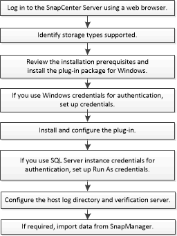

= Install workflow for SnapCenter Plug-in for Microsoft SQL Server
:icons: font
:imagesdir: ../media/

[.lead]
You should install and set up the SnapCenter Plug-in for Microsoft SQL Server if you want to protect SQL Server databases.

