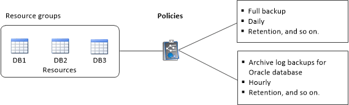

= Create resource groups and attach policies for Unix file systems
:icons: font
:imagesdir: ../media/

[.lead]
A resource group is a container where you add resources that you want to back up and protect. A resource group allows you to back up all the data that is associated with the file systems.

.About this task

* A database with files in ASM disk groups must be in "MOUNT" or "OPEN" state to verify its backups using the Oracle DBVERIFY utility.
+
Attach one or more policies to the resource group to define the type of data protection job you want to perform.
+
The following image illustrates the relationship between resources, resource groups, and policies for databases:
+

* For SnapLock enabled policies, for ONTAP 9.12.1 and below version, if you specify a Snapshot locking period, the clones created from the tamper proof Snapshots as part of restore will inherit the SnapLock expiry time. Storage admin should manually cleanup the clones post the SnapLock expiry time.

* Adding new databases without SnapMirror active sync to an existing resource group which contains resources with SnapMirror active sync, is not supported.
* Adding new databases to an existing resource group in failover mode of SnapMirror active sync is not supported. You can add resources to the resource group only in regular or fail-back state.

.Steps

. In the left navigation pane, select *Resources*, and the appropriate plug-in from the list.
. In the Resources page, click *New Resource Group*.
. In the Name page, perform the following actions:
 .. Enter a name for the resource group in the Name field.
+ 
NOTE: The resource group name should not exceed 250 characters.
 
 .. Enter one or more labels in the Tag field to help you search for the resource group later.
+
For example, if you add HR as a tag to multiple resource groups, you can later find all resource groups associated with the HR tag.
 .. Select the check box, and enter a custom name format that you want to use for the Snapshot name.
+
For example, customtext_resource group_policy_hostname or resource group_hostname. By default, a timestamp is appended to the Snapshot name.

. In the Resources page, select an Unix file systems host name from the *Host* drop-down list.
+
NOTE: The resources are listed in the Available Resources section only if the resource is discovered successfully. If you have recently added resources, they will appear on the list of available resources only after you refresh your resource list.

. Select the resources from the Available Resources section and move them to the Selected Resources section.
. In the Application Settings page, perform the following:
* Select the Scripts arrow and enter the pre and post commands for quiesce, Snapshot, and unquiesce operations. You can also enter the pre commands to be executed before exiting in the event of a failure.
* Select one of the backup consistency options:
** Select *File System Consistent* if you want to ensure that file systems cached data is flushed before creating the backup and no input or output operations are allowed on filesystem while creating the backup.
+
NOTE: For File System Consistent, Consistency group snapshots will be taken for LUNs involved in Volume group.
** Select *Crash Consistent* if you want to ensure that file systems cached data is flushed before creating the backup.
+
NOTE: If you have added different file systems in the resource group, then all volumes from different file systems in the resource group will be put in a Consistency group.
. In the Policies page, perform the following steps:
 .. Select one or more policies from the drop-down list.
+
NOTE: You can also create a policy by clicking image:../media/add_policy_from_resourcegroup.gif[add symbol].

+
In the Configure schedules for selected policies section, the selected policies are listed.

 .. Click image:../media/add_policy_from_resourcegroup.gif[add symbol] in the Configure Schedules column for the policy for which you want to configure a schedule.
 .. In the Add schedules for policy _policy_name_ window, configure the schedule, and then click *OK*.
+
Where, _policy_name_ is the name of the policy that you have selected.
+
The configured schedules are listed in the Applied Schedules column.

+
Third party backup schedules are not supported when they overlap with SnapCenter backup schedules.

. In the Notification page, from the *Email preference* drop-down list, select the scenarios in which you want to send the emails.
+
You must also specify the sender and receiver email addresses, and the subject of the email. If you want to attach the report of the operation performed on the resource group, select *Attach Job Report*.
+
NOTE: For email notification, you must have specified the SMTP server details using the either the GUI or the PowerShell command Set-SmSmtpServer.

. Review the summary, and then click *Finish*.
