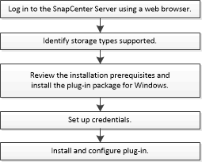

= Installation workflow of SnapCenter Plug-in for Microsoft Windows
:icons: font
:imagesdir: ../media/

[.lead]
You must install and set up SnapCenter Plug-in for Microsoft Windows if you want to protect Windows files that are not database files.

