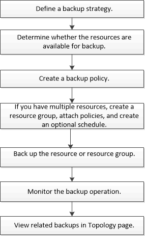

= Back up Windows file systems
:icons: font
:imagesdir: ../media/

[.lead]
When you install the SnapCenter Plug-in for Microsoft Windows in your environment, you can use SnapCenter to back up Windows file systems. You can back up a single file system or a resource group that contains multiple file systems. You can back up on demand or according to a defined protection schedule.

You can schedule multiple backups to run across servers simultaneously. Backup and restore operations cannot be performed simultaneously on the same resource.

The following workflow shows the sequence in which you must perform the backup operations:

You can also use PowerShell cmdlets manually or in scripts to perform backup, restore, and clone operations. The SnapCenter cmdlet help or the https://library.netapp.com/ecm/ecm_download_file/ECMLP2883300[SnapCenter Software Cmdlet Reference Guide^] contains detailed information about PowerShell cmdlets.
