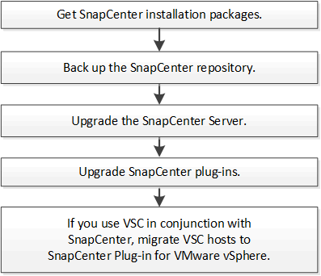

= Upgrade workflow
:icons: font
:imagesdir: ../media/

[.lead]
Each release of SnapCenter contains an updated SnapCenter Server and plug-in package. Plug-in package updates are distributed with the SnapCenter installer. You can configure SnapCenter to check for available updates.

The workflow shows the different tasks required to upgrade the SnapCenter Server and the Plug-in packages.

== Supported upgrade paths

The upgrade path helps you to understand from which all earlier versions of SnapCenter you can upgrade to the latest versions of SnapCenter and which versions of the plug-ins are supported.

|===
| If you are on SnapCenter Server version... | You can directly upgrade SnapCenter Server to... | Supported plug-in versions

.3+| 5.0
| 6.0
a|
* 5.0
* 6.0

| 6.0.1
a|
* 6.0.1
|6.1
a|* 6.1

.2+| 6.0
a| 6.0.1
a|
* 6.0
* 6.0.1

| 6.1
a|
* 6.1

|6.0.1
 | 6.1
a| 
* 6.0.1
* 6.1

|===

For information about upgrading the SnapCenter Plug-in for VMware vSphere, see https://docs.netapp.com/us-en/sc-plugin-vmware-vsphere/scpivs44_upgrade.html[Upgrade SnapCenter Plug-in for VMware vSphere^].