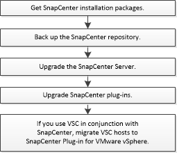

= Upgrade workflow
:icons: font
:imagesdir: ../media/

[.lead]
Each release of SnapCenter contains an updated SnapCenter Server and plug-in package. Plug-in package updates are distributed with the SnapCenter installer. You can configure SnapCenter to check for available updates.

The workflow shows the different tasks required to upgrade the SnapCenter Server and the Plug-in packages.

== Supported upgrade paths

|===
| If you are on SnapCenter Server version... | You can directly upgrade SnapCenter Server to... | Supported plug-in versions

.2+| 4.4.x
| 4.5.x
a|
* 4.4.x
* 4.5.x

| 4.6.x
a|
* 4.6.x

.2+| 4.5.x
|4.6.x
a|
* 4.5.x
* 4.6.x

| 4.7
a|
* 4.7

a| 4.6.x

a| 4.7

a|
* 4.6.x
* 4.7
|===

IMPORTANT: For example, if you are on SnapCenter version 4.4.x and want to upgrade to 4.7, you should first upgrade to 4.6.x and then do a rolling upgrade to 4.7.

NOTE: For information about upgrading the SnapCenter Plug-in for VMware vSphere, see https://docs.netapp.com/us-en/sc-plugin-vmware-vsphere/scpivs44_upgrade.html[Upgrade SnapCenter Plug-in for VMware vSphere^].
